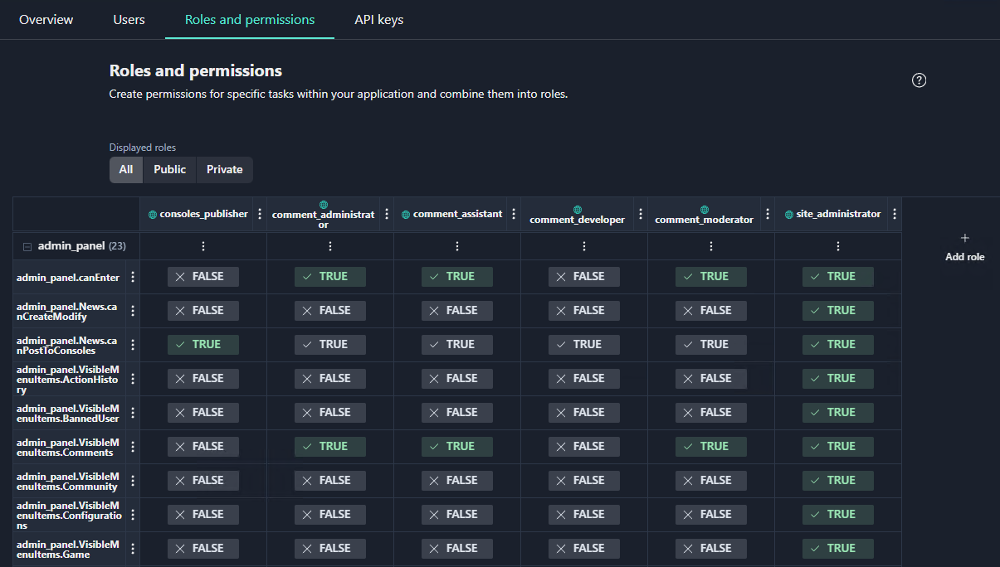

This topic explains the basic concept of roles and permissions within Gaijin Application Platform (GAP).

When you create a project, GAP automatically creates an application of the same name as the project. Game developers can use this application to set up a system of permissions for the application, services, service accounts, and for the Central application.

The **permissions system** is a set of user action **permissions** and user **roles** that combine permissions. For example, to be able “shooting” and “running” in the game, the user needs the role that includes the corresponding permissions allowing a player to “shot” and to “run”. A permission is an atomic unit of access allowing a user to perform a particular action. Whereas a role is a set of permissions assigned to a user in order to provide required access rights and enable a user to perform necessary actions within the application.

#### Permissions

Permissions are created by developers at the application level. Any application created by its author uses the system of permissions and roles, enabling a user to perform a certain action or a group of actions in the project.

For example, the application may allow a user to download games or view a player’s inventory. It may also allow a developer to upload the required version of the game on certain servers and make it available to other users.

In this case, both the person who uploads the game and the one who downloads the game must have the corresponding permissions to perform these actions. If an application gets a request for an action that the user does not have a permission, it will generate the “access denied” response.

#### Roles

A **role** is a set of permissions assigned to a user. Users may have multiple roles that define access rights and enable users to perform the required actions within the application.

An application developer or a user with administrative privileges can  create roles by combining permissions into various sets for different users.

**Note**: For details on creating rolls and permissions refer to the [Roles and Permissions management](../central/roles-and-permissions_manage.md) section.

For example, Uploader is a role for uploading data into the system. A user with the Uploader role can perform deployment, but cannot set tags. Publisher is a role for the one who manages versions of the application and sets tags that make it easier for users to download the game, etc.

#### Application schema

To define the **permissions system** containg a combination of permissions and roles, an application developer creates the **application schema**. Having the application schema, you can add users to your application and give them roles. As an application developer, you decide what users can and cannot do in the application and what roles are required for this. For details on creating an application schema, see [Adding an Application Schema](../central/roles-and-permissions_manage.md#adding-an-application-schema).

Developers can share the application schema with other developers, enabling them to use this system of permissions for their projects.

GAP presents the configured application schema as a table containing the list of permissions (first column) and roles (first row).

A developer can manually add or remove a permission for a role in the **Roles and permissions** table by selecting the field value (TRUE/FALSE) in the corresponding cell.

#### Public and Private roles

There are two types of roles — public and private.

- **Public** — roles assigned to users in a project scope; they are available to everyone who has access to the project (marked with blue symbol). Those who connected the application as a service can assign public roles.
- **Private** — roles that are assigned in the scope of the application and available to certain users who perform administrative and service actions, for example, manager, support, etc.
Private roles are assigned by the application developer.

**Note**: public roles are used only if the application is a service.

#### Assigning multiple roles

Roles combine permissions according to a particular business task. There can be dozens of separate permissions within a single application. Since you can assign several roles to a user, you don’t have to create many complicated roles. Instead, it is much better to create several roles complementary to each other and assign a necessary role combination to a particular user. This enables administrators flexibly to add (or remove) a permitted task to a role assigned to multiple users.

For example, you created the Moderator role and assigned it to the number of users. If later you decide to grant all moderators with the ability to ban players, you just need to add the user.ban permission to the Moderator role. This will enable users with the Moderator role to ban players.

#### Temporary roles
Sometimes a developer needs to assign a role not permanently, but on a temporary basis, limiting its lifetime.

One scenario of using a temporary role is to set a default permission, and then assign a role that would remove this permission after a specified time. For example, a developer can give the play game permission (`play_true`)  to all users, and then assign to a specific user a role that takes away the right to play. This technique enables a developer to create a system for flexible control of user actions.