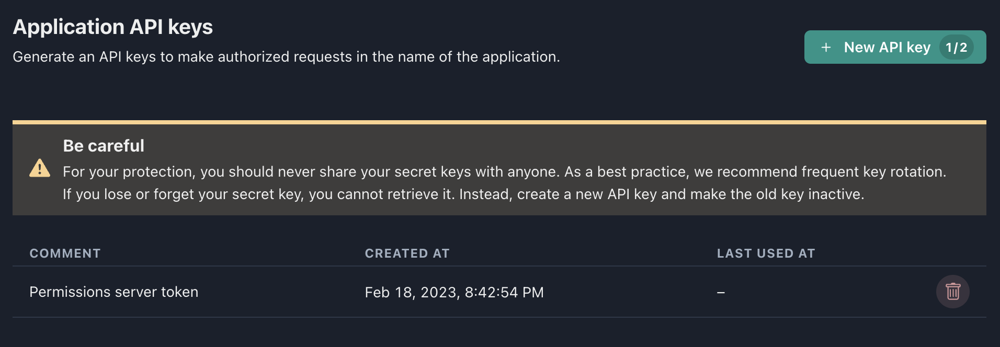

To make authorized requests to GAP API in the name of the application, you need to generate an API key. It can be done at any time in the **API keys** section.

You can have a maximum of **two active tokens** at the same time. Two tokens are necessary in case you need to reissue a token, for example, because the current one was compromised. In this case you can issue a new token, replace the current token with the new one and then remove the previous token, thus making it invalid.

:::caution

When generated, the new token should be saved. Once created, it cannot be restored. Only a new one can be issued. It is not advisable to generate an access token until you really need it.

:::
