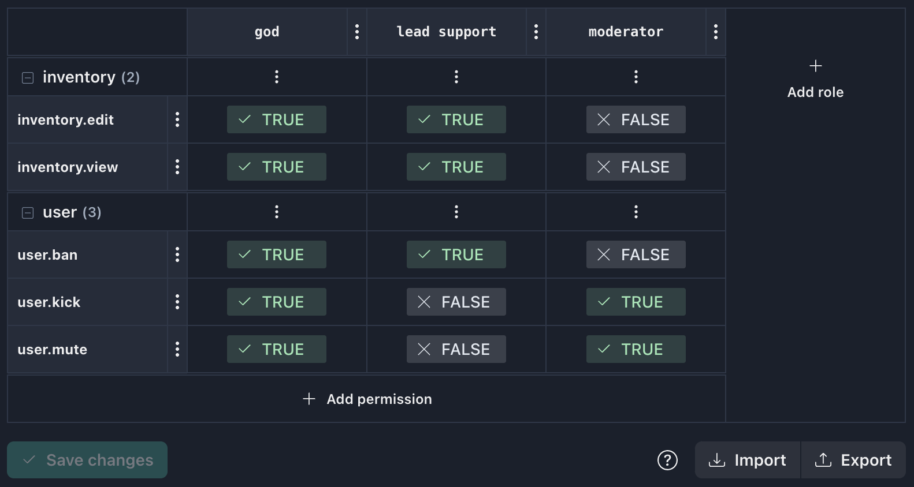
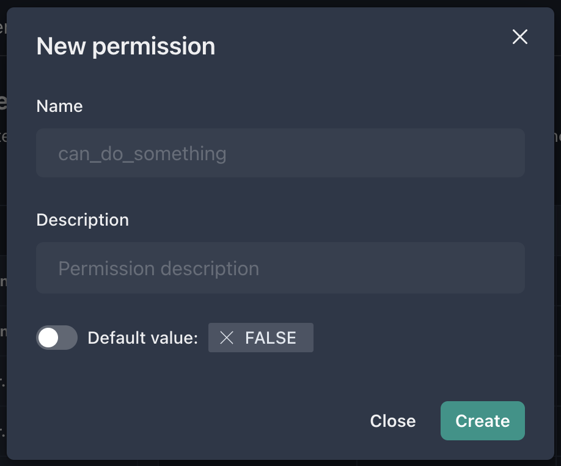
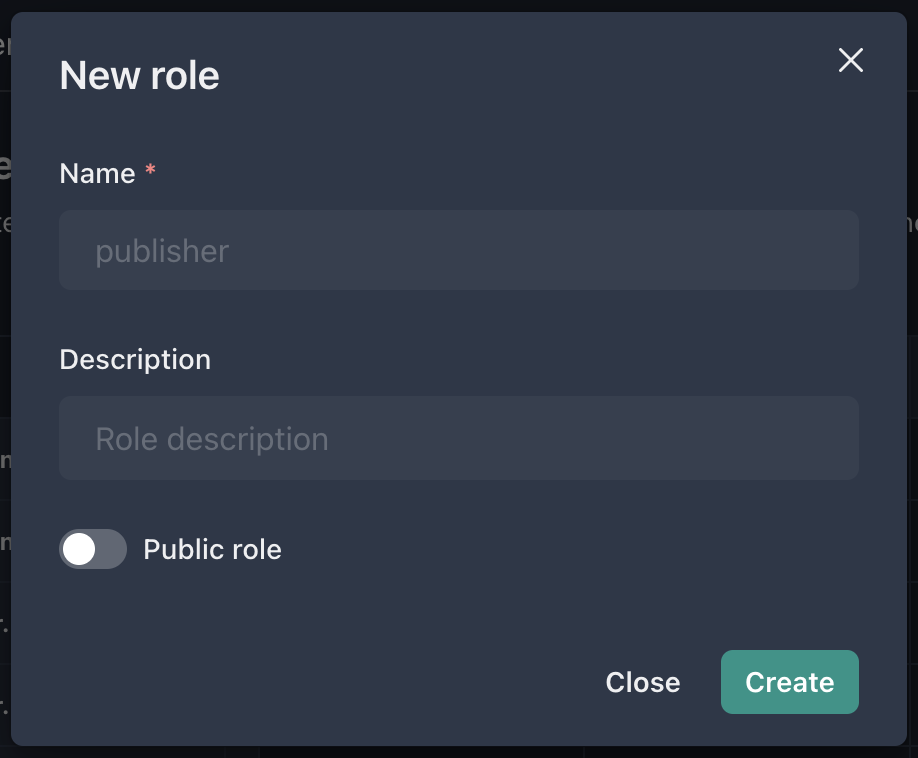
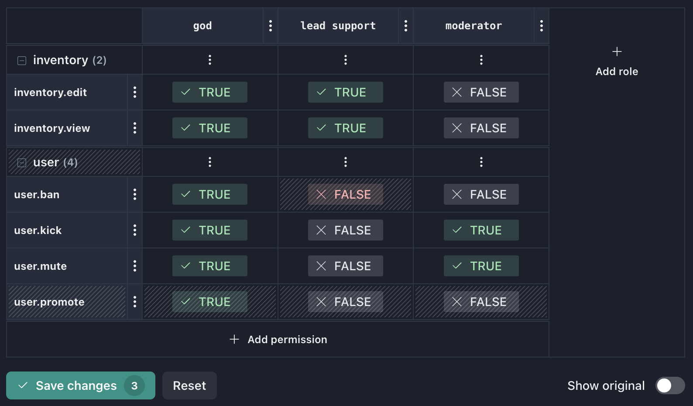
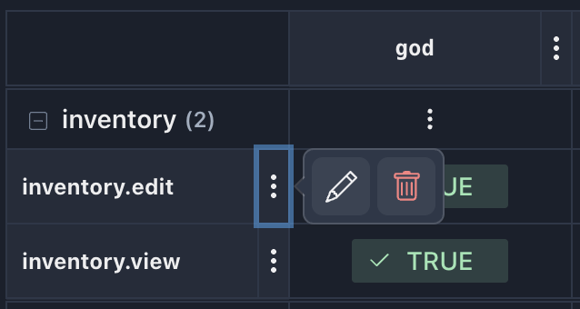
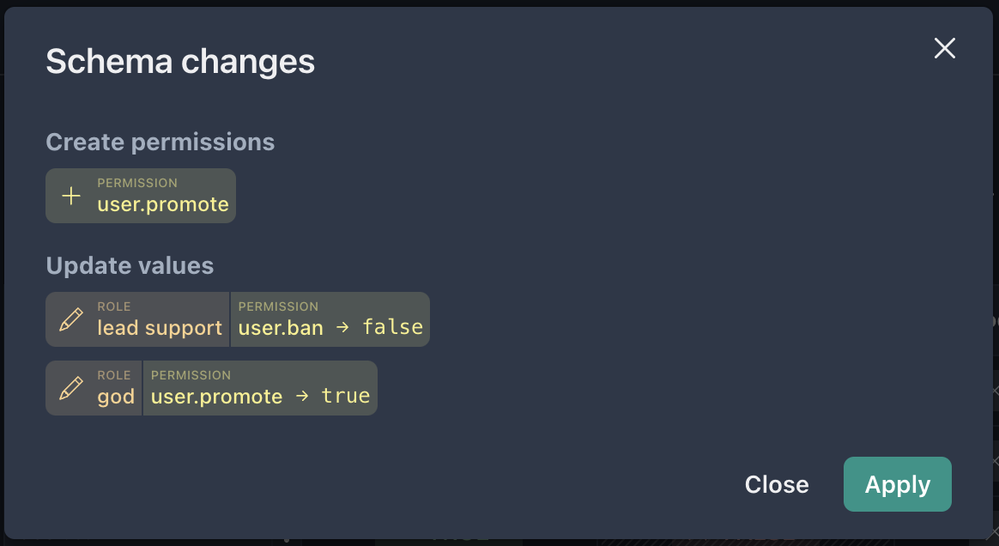
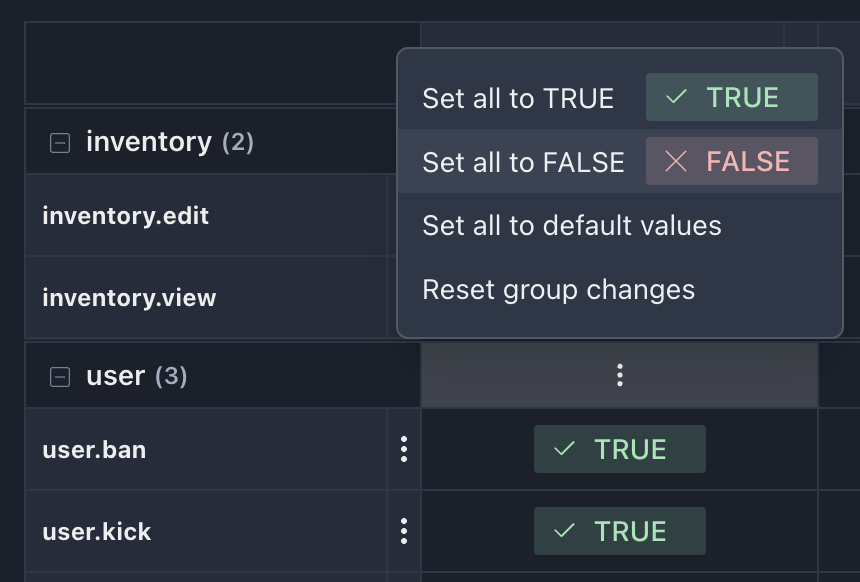
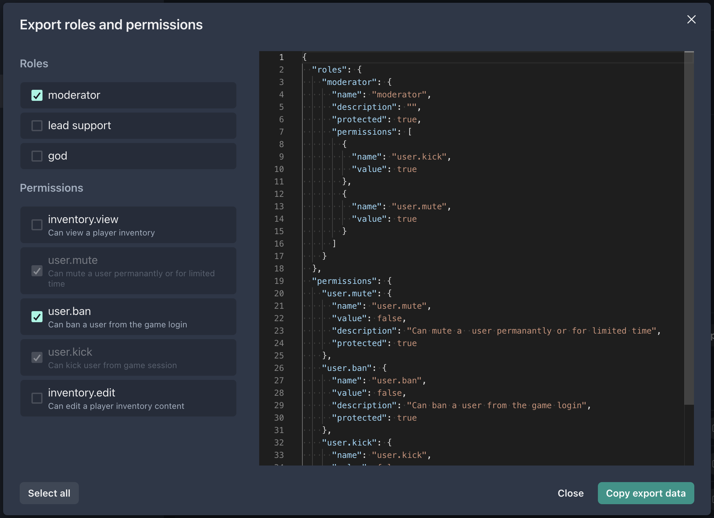

The page allows you to manage roles and permissions within the application (i.e. changing application schema). A permission is an atomic unit of access to an application. Whereas a role is a set of permissions that are assigned to a user and define his access rights within the application.

## Application schema

Every user may assume several roles at the same time. So, there is no sense in creating a large number of complicated roles that differ literally in a couple of features. It is better to create several roles complementary to each other and assign a necessary role combination to a particular user.

### Creating a permission

To create a new permission, click the **Add permission** button at the bottom row of the table.

In the modal window that opens, there is the following form:

- **Name** _(required)_ – application-wide unique permission key. You can name permissions any way you like, but for large schemas we recommend using prefixes in the name (e.g. `user.login`) for convenient [grouping of permissions](#grouping-permissions).
- **Description** – a text field describing the purpose of the permission
- **Default value** – `TRUE` or `FALSE`

!!!note
    Permissions do not function on their own. An application can request permissions assigned to a particular user and retrieve a list of actual permissions. The rest is on the part of the application itself.

### Creating a role

To create a new role, click the **Add role** button at the right column of the table.

In the modal window that opens, there is the following form:

- **Name** _(required)_ – application-wide unique role key
- **Description** – a text field describing the purpose of the role
- **Public role** flag – if selected, the role will be available for selection as a project role

### Setting permissions for roles

The value of each permission within a role can be set to `TRUE`, `FALSE` or the _default value_ defined for that permission. The value in a table cell changes with toggle button that cycles between three options upon clicking (`TRUE → FALSE → default → TRUE → ...`)

To edit or delete an existing role or permission, click the button next to its name (three dots). Note that editing the names of already created roles and permissions is not allowed.

!!!note
    Keep in mind that changes to the table do not occur instantly. Instead, the operations performed are written to the stack and are applied only after you click the **Save changes** button.

The **Save changes** button displays an edit counter, and the changed fields are highlighted in the table by a special shading. You can also rollback edits by pressing the **Reset** button, or display the view of the table before the changes made by changing the **Show original** switcher.

After clicking on the **Save changes** button, an overview of the changes (added, deleted, changed roles and/or permissions, updated values) will be shown. The **Apply** button will save these changes to the server.

### Grouping permissions

For large schema applications, Central provides convenient permission grouping functionality. In order to combine a set of permissions into a logical group, you have the ability to specify a permission name in the format `<group>.<permission>`. For example, the schema may have permissions named `inventory.edit` and `inventory.view`, which will automatically be grouped into the `inventory` group. You can use any level of nesting in the name, but grouping will be by prefix up to the first dot. Each group can be collapsed or expanded in the user interface as desired, and edits can be made to the schema for the entire group at once.

It is important to note that the use of a dot in the name of permissions does not impose any additional functionality, but is only used for convenient structuring of the schema.

!!!warning
    If you group permissions using a dot, you cannot use the prefix as the name of an individual permission. For example, you cannot use `inventory` and `inventory.edit` permissions in the schema at the same time. This applies to permissions of any nesting level.

## Export/Import schema

The export modal window contains a list of roles and permissions that are available for selection. Note that when you select an individual role for export, the permissions related to that role are automatically selected (with no possibility of exclusion). As a result of selecting roles and permissions, in the right part of the list is generated JSON data for export. You must click **Copy export data** to put the data to the clipboard.

To import data, go to the roles page in another application, click **Import**, paste the information from the clipboard and click **Import**.
