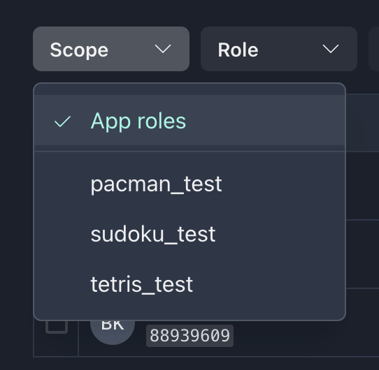
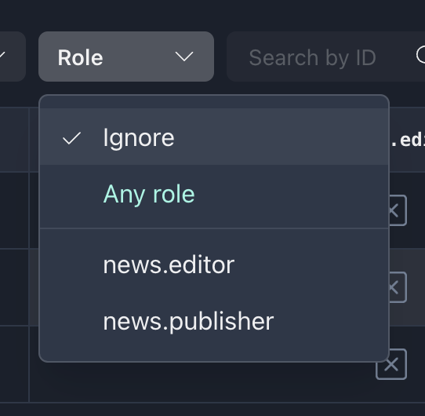
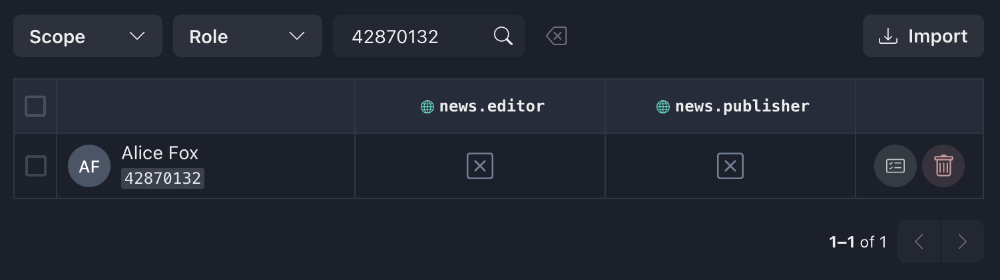
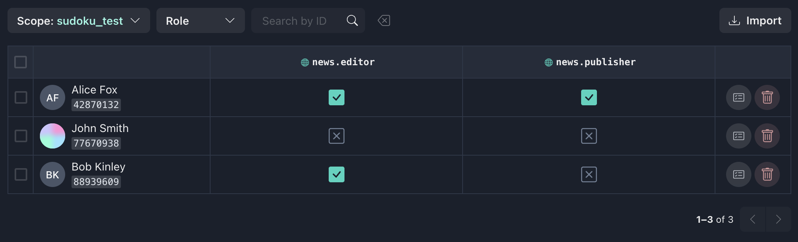
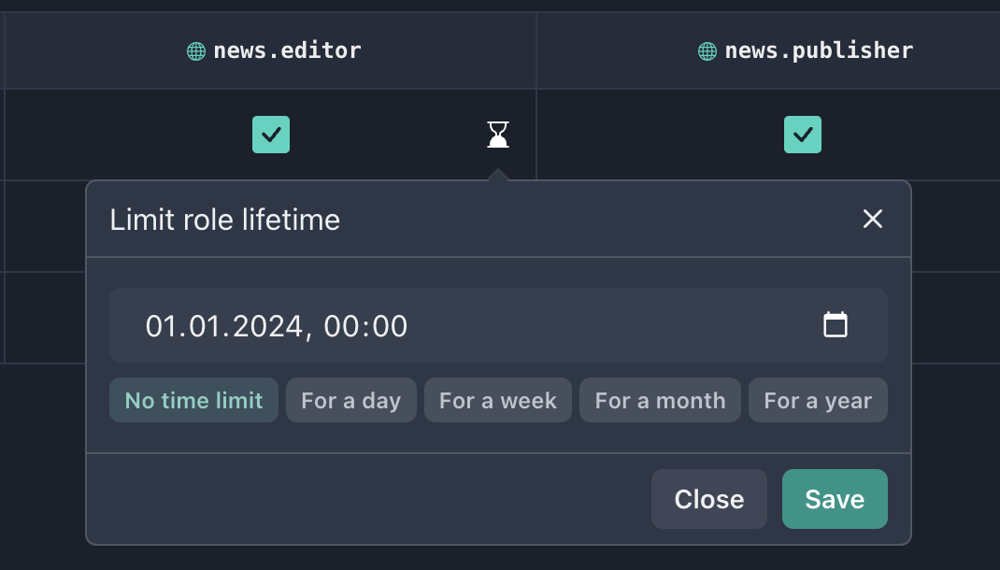
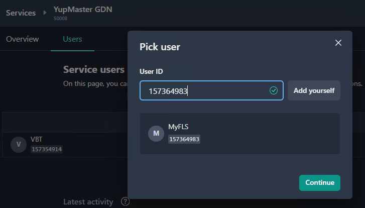
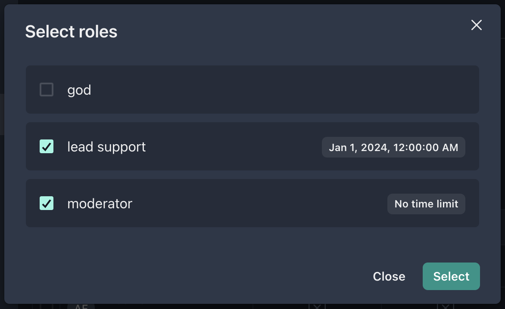
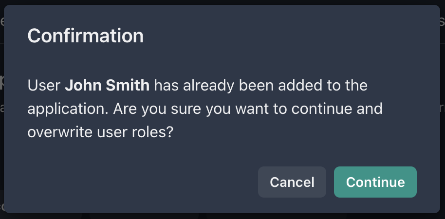
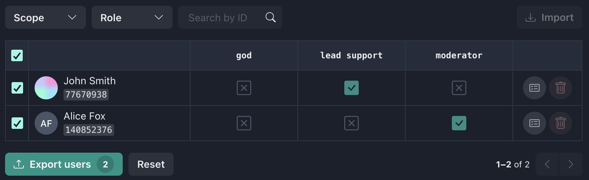
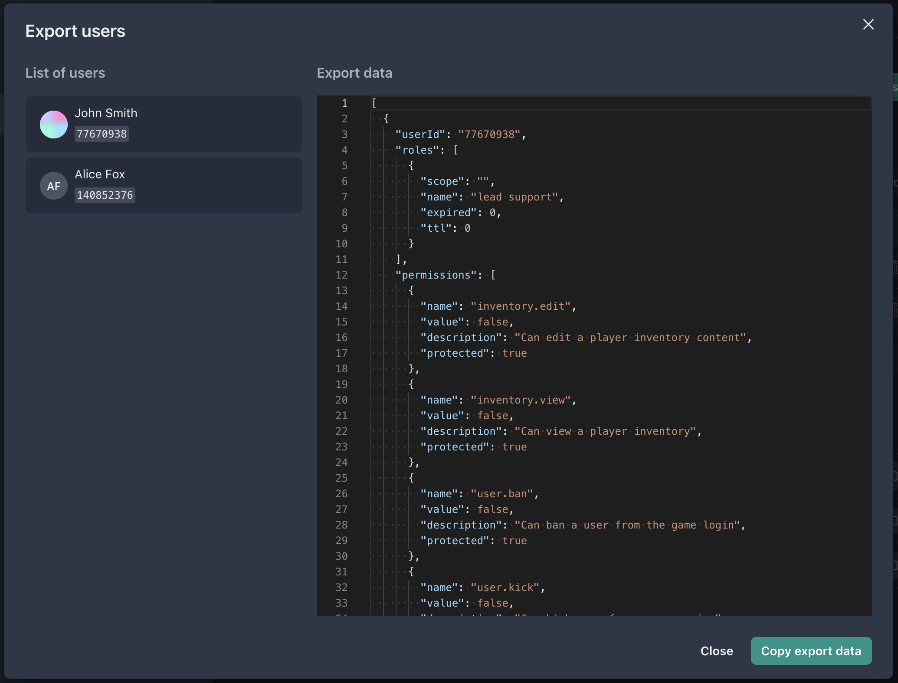

This page serves as a powerful tool for user management, allowing administrators to effectively manage their users in the application. It includes a paginated list of users with a filtering section that allows the administrator to search for users by project, role, or user ID. In addition, there is the ability to add or remove users, as well as the flexibility to manage each user's roles. The page also allows administrators to import and export records.

## Filtering list of users

### "Scope" selector

Allows you to search for users at the root of an application or in a specific project.

### "Role" selector

Possible filtering options by role:

- **Ignore** - filtering completely ignores the "Role" field
- **Any role** - this is equivalent to passing the list of all available roles to the application
- Select a **certain role** from the list - filtering by the presence of the specified role in the user

### "Search by ID" field

Allows you to search for an individual user by `user_id`. As a result of a successful query, only one user will be represented in the table.

### Examples of filter usage

|     Scope     |     Role      | Result                                                                                            |
| :-----------: | :-----------: | ------------------------------------------------------------------------------------------------- |
|   App roles   |    Ignore     | Get the list of all users in an application                                                       |
|   App roles   | `news.editor` | Get the list of users who have a `news.editor` role at the root of this application               |
| `sudoku_test` |   Any role    | Get the list of users who have at least one role in the `sudoku_test` project of this application |

## List of users

The page provides a access table to the application that consists of rows and columns, where each row represents a **user** and each column represents a **role**. The purpose of an access table is to define which users have access to specific roles within an application. Each cell in the table represents whether a particular user has been granted access to a specific role, with a value of `TRUE` or `FALSE`.

Each line contains the following elements:

1. **Checkbox** - used to further export this user and his roles to another application
2. **User profile** - information about user: avatar, display name, `user_id` (copy to clipboard on click)
3. **Role cells** - toggle value of role (the name is specified in the column header). If the role is selected, you can specify the time limit until which this role will be installed for this user (The timer button appears in the cell when you hover mouse over it). By default, the role is not limited in time. In the time limit selection widget, there are ready-made limit presets (per day, per week, etc.). To specify the date and time yourself, you must click on the calendar icon, select the date and time or enter the value manually in the format `dd.mm.yyyy hh:mm`.

   

4. **Actions** on the user - open the user editing page, as well as delete the user from the application

### Saving changes to the user list

Changes in access rights do not happen instantly. Instead, the performed operations (setting or deleting the role, as well as changing the time limit) are written to the stack and are applied only after you press the **Save changes** button. The button displays a counter of users for which edits will be made, and the changed fields are highlighted with special shading. You can also rollback the changes by pressing the **Undo changes** button.

:::note
You can make changes on more than one page.
:::

After clicking on the **Save changes** button, a window with an overview of the access rights changes for each individual user will be displayed. The **Save** button will apply the changes to the server.

### Adding new users

The **Add User** button will open a modal window with `user_id` input. If the user is successfully found, the information about him will be displayed below and the **Continue** button will become active.

There is also an option to use your `user_id` when you click the **Select yourself** button.

The next step will display a modal window with a choice of roles for the new user. You can select multiple roles or not select roles at all. It is also possible to specify the time limit for which this role should be set.

:::info
If the selected user already exists in the list of users of this application, an alert window about record conflict will be shown.

:::

## Export/Import users

To make it easy for the administrator to export some (or all) users from one application to another, there is an export option.

---

To export records, select the desired users using the checkboxes.

:::note
You can pick users from more than one page.
:::

Then click on the **Export** button (where the counter of selected records will be displayed) to open export modal.

The list of users and JSON data to be exported will be displayed in the opened window. You should click **Copy export data** to put the data to the clipboard.

To **import data**, go to the users' page in another application, click the **Import** button, paste the information from the clipboard and click the **Import data** button.
