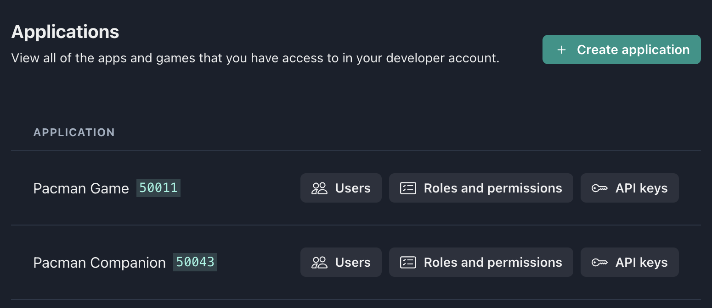
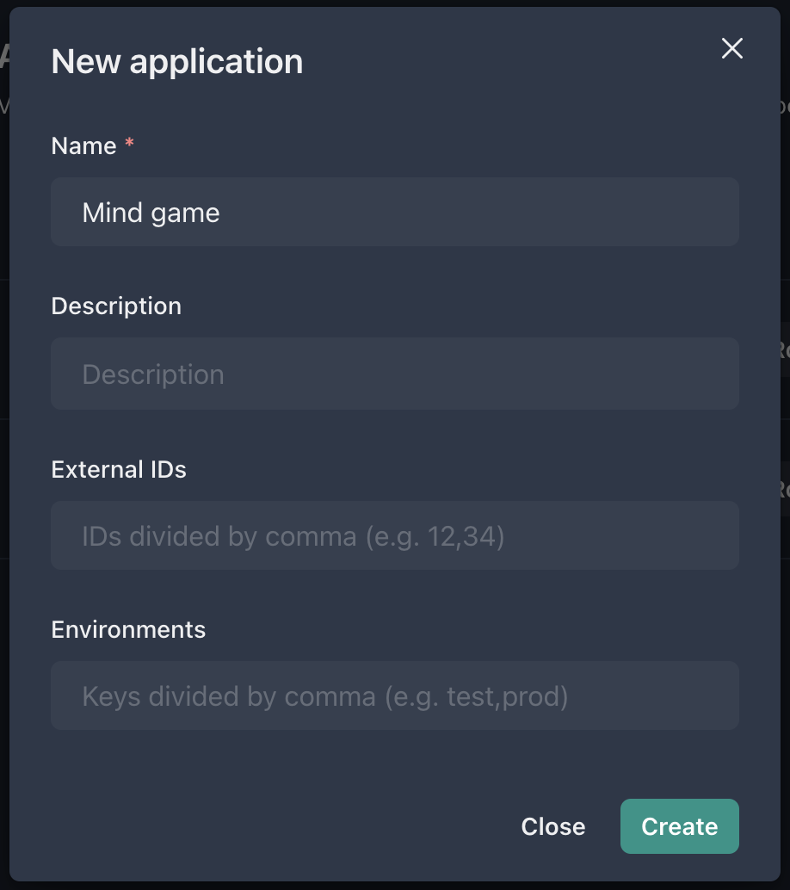

Application – a logical entity, allowing for breaking a project into separate subsystems, each of whom can have its own permissions, its roles, and its own administrators. It is usually enough for a small project to have just one application. Additional applications within a project can be created at any time. Each application is fully independent and in no way affects the other applications.

---

In which cases will it be convenient to have several applications? If a project consists of several subsystems that are quite independent. For example, a game itself, which may require moderators, community managers or players with the permission to temporarily mute other players. A marketplace may stand alone, having a completely different range of permissions and roles. It will require permissions to manage transactions, refund, modify players’ inventory and so on.

### Creating a new application

#### Possible next steps after creating an application:

- [Create a schema](application-schema) for access control, in other words add roles and permissions
- Adding other [users](application-users) to the application
