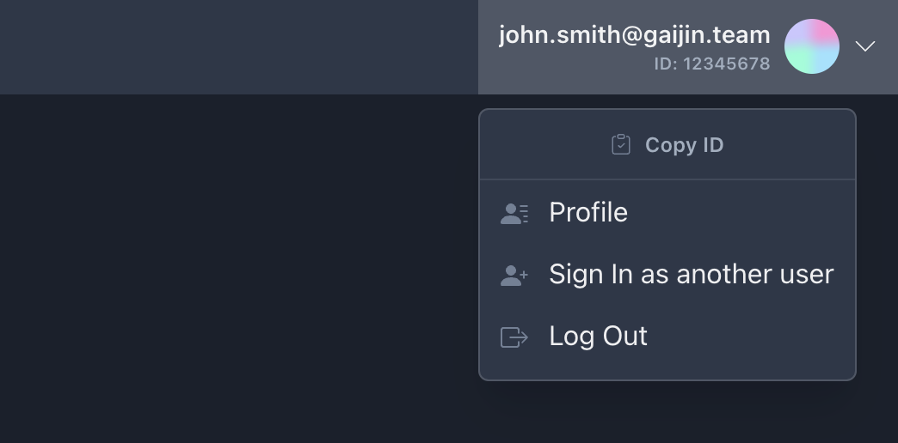

[Gaijin Central](https://central-admin.gaijin.net/) is a comprehensive portal that allows developers to easily manage their applications, users and services.

## Authorization

!!!note
    A **Developer License** is required to access Gaijin Central. You can read more about the requirements and the process of obtaining the Developer License in [this section](../newcomers-guide/getting-started.md#getting-a-developer-license).

In order to sign in to Gaijin Central, click on **Get Started** on the home page, and then sign in to SSO. If successful, you will be redirected to a **Start page** with a list of projects and services available for your account.

If you have the required access rights to create new projects, this page will also display the [Create new project](project.md#new-project) button.

## Understanding the fundamentals of Central

- A Central [project](project.md) is like a container for all applications you create and any resources and services provisioned for the project.

- A project can contain one or more [applications](applications.md) registered to it (for example, the game application and mobile companion app for it). The core function of the application is to manage access for [users](application-users.md).

-  Any application should have an application schema created. [Application schema](roles-and-permissions_manage.md#app-schema), in a general sense, is the set of [roles and permissions](../basic_concepts/roles-and-permissions_concepts.md) by which an application is accessed. Each role has its own set of permissions, which can be customized to meet the needs of a particular group of users.

- An application allows you to generate [Application API keys](application-api-keys.md) to make authorized server-side requests in the name of the application.

- Connecting [services](services.md) to the project, you can provide extended functionality for your applications, for example, a service for publishing content, community bug reporting, forums, and so on.

## User interface

### Account menu

The Account menu button can be found in the top-right corner of the page. This menu enables you to:

- Copy user ID. This can be useful when adding yourself to the list of users of an application or service
- Go to your [Profile](user-profile.md) page
- Sign in with another account
- Sign out of your account

### Start menu

The Start menu button can be found in the top-left corner of the page and provides a navigation list of available projects, applications, and services. In this menu you can also find the [Create new project](project.md#new-project) button if you have the required permissions

### Side navigation

The main navigation menu of active project. Here you can also change the **interface language** or switch the **color theme** (light or dark)
