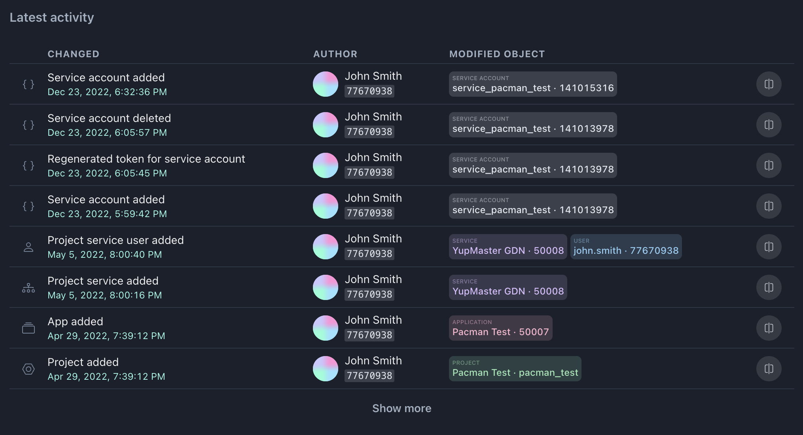
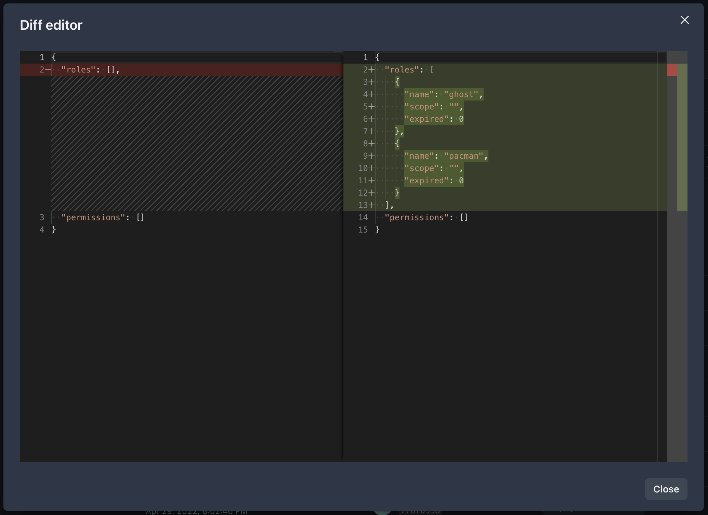

In Central every significant action performed by the user is recorded in the event log. This means that any action that has an impact on the system or application, such as modifying access rights in the application, creating a new API key or service account, is logged and stored for future reference. It is designed to help administrators monitor and analyze user behavior and ensure compliance with security policies.

---

On the most important pages of Central there are **Latest activity** blocks with a table of 30 recent changes. At the bottom of the table there is a **Show more** button for going to a more detailed log page. This block is presented on four pages:

- [Project overview](project.md)
- [Application overview](applications.md)
- [Application schema](application-schema.md)
- [Application users](application-users.md)

### Log events

Each line contains information:

- **The subject** of the changes – a text description of the event, as well as the date and time
- **Author** of the changes – information about the user who made the changes (in case of project's history of changes - project profile is displayed)
- **Change objects** – list of entities which were changed or belong to the object of changes. Entity types: _Project_, _App_, _Service_, _User_, _Role_, _Permission_, _Service account_, _API key_. Change objects contain information - for a _Project_, _Application_, _Service_ or _User_ this is an `id`, for a _Role_ or _Permission_ this is a `name`, etc.
- The **Show changes** button (if available) – opens a dialog box with the editor, where the state before and after changes is compared side by side.

### Diff editor

This dialog box allows you to compare data before and after changes side by side. The read-only editor inside of it displays the differences in an easy-to-read format, highlighting the changes in color-coded text.

