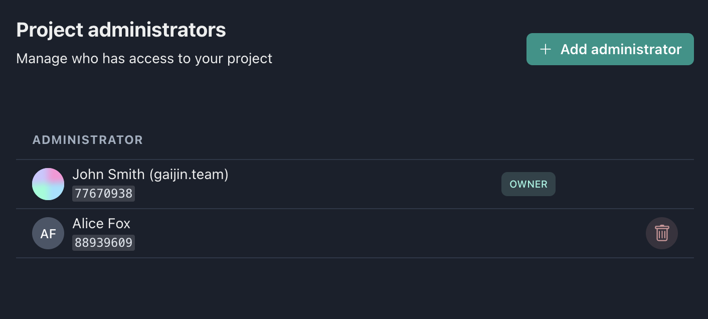
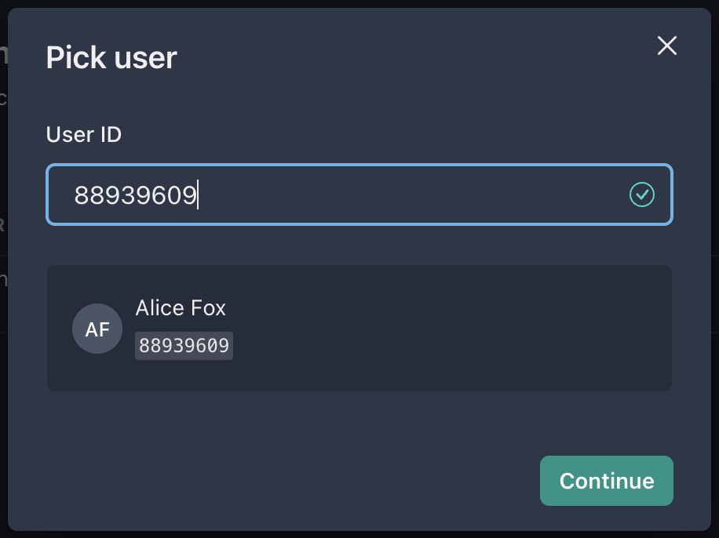
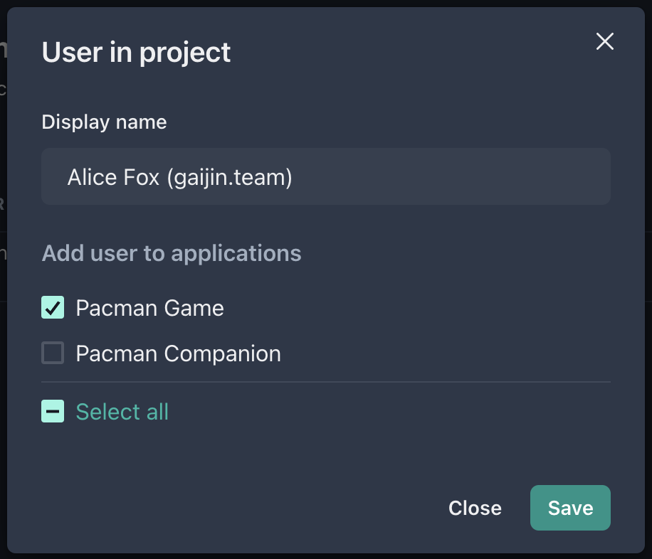

This section contains a list of users who have rights to manage project resources.

There are currently two project roles: **Owner** and **Administrator**. A project can have any number of administrators, one of them being its owner. Administrators have full permissions within the project except for being unable to remove the project owner.

---

## Add administrators

!!!note
    For security reasons, to add administrator to the project, it is necessary for him to have two-factor authorization (2FA) enabled with the code generator application.

The **Add administrator** button will open a modal window with **User ID** field. If the user is successfully found, the information about him will be displayed below and the **Continue** button will become active.

When the user has been selected, you will be prompted to specify his **display name** within the project, as well as a **list of applications** to which he can be added automatically.

!!!top
    Many users use nicknames in their accounts. Use the possibility of changing a user’s Display Name so as not to get confused about who is who.
