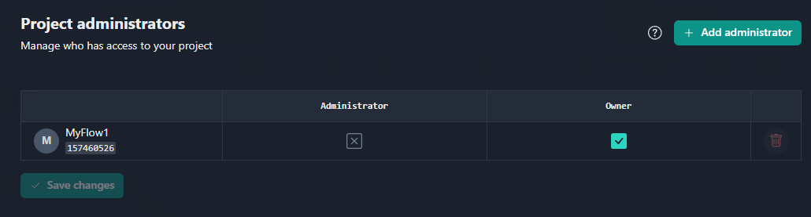
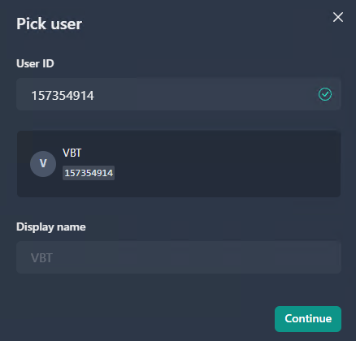
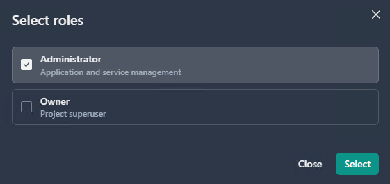
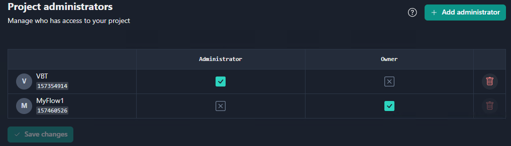
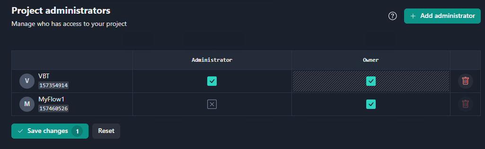
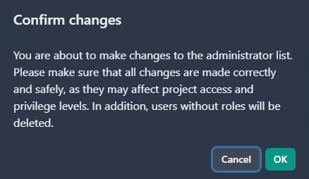
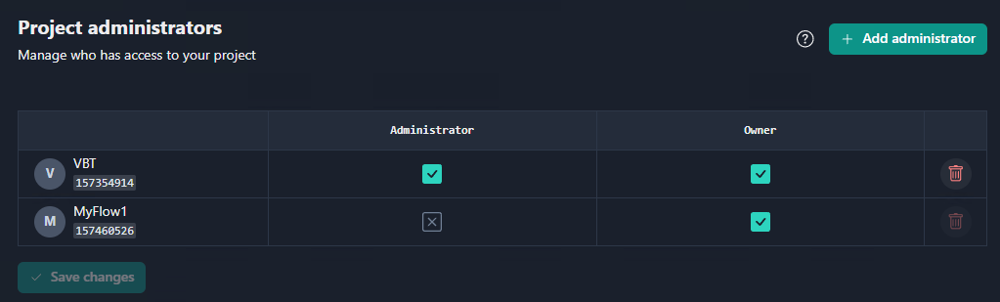
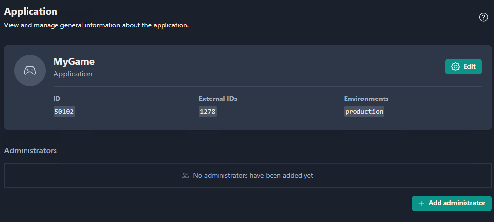
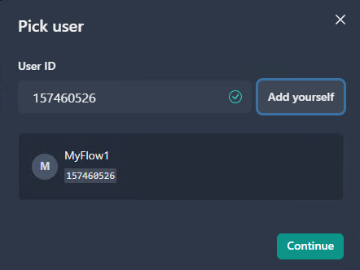
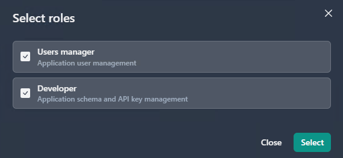

This section outlines users with admin privileges to manage project resources.

There are currently two project roles: **Owner** and **Administrator**. A project can have any number of administrators, one of them being its owner. Administrators have full permissions within the project except for being unable to remove the project owner.
Suppose that you are a game developer who came to Gajin and want to develop games with your own services. The author of the project is the project owner by default. Having created a project, you can manage project users by adding project **administrators** and **owners**. 
The difference between Project owner and Project administrator roles: 

- **Project owner** - can only add (or remove) administrators
- **Project administrator** - can manage various project entitites (such as applications, services, and service accounts), but not the owner.

### Adding a project administrator
1. Click the **Administrators** tab. This will open the page where you can add Project administrators. 

When you create the project, the system automatically adds you to the list of project administrators as the project owner by default. This user cannot be deleted from the **Project administrators** list but later you can change the project ownership. You can check or uncheck the **Administrator** and **Owner** checkboxes to assign the user with the Administrator, Owner, or both roles.

**Note:** There must be at least one owner of the project

 
2. Click the **Add administrator** button

To add an administrator, you need the user ID. Users can provide their UIDs, but you can also find and copy UIDs on the users list. 

2. Click **Continue**.

Now you can select roles for the user you add. You can add the user as the **Administrator**, as the **Owner**, or with both roles. 

3. Click **Select**.

The project administrators are now added to the project.

### Adding a project owner

If you need to have more that one owner in the project, you can assign a user from the Project administrators list to be a project owner. 

To add a new owner to the project:

1. Check the **Owner checkbox** next to the user you wish to grant the project ownership.
2. Click **Save changes**.

3. In the **Confirm changes window**, click OK

The new owner is now added to the project.

### Adding admistrators to an application.

On the **Application page**, you can find the list of administrators added to the application. The administrators list is still empty since no administrators have been added to the project yet. 

To add an administrator to the application:

1. Open the application on the *Applications* page.
2. Click the **Add administrator** button.
3. In the **Pick user** window, enter the UID or click **Add yourself**.

3. In the Select roles window, check the boxes next to the Application administrator roles (User manager/Developer).

These roles enable an administrator to perform the following actions:

- Developer manages:
  - The application schema (roles and permissions)
  - Application API keys

- Users manager can:
  - View a list of application users
  - Assign users with the schema roles supported by the application