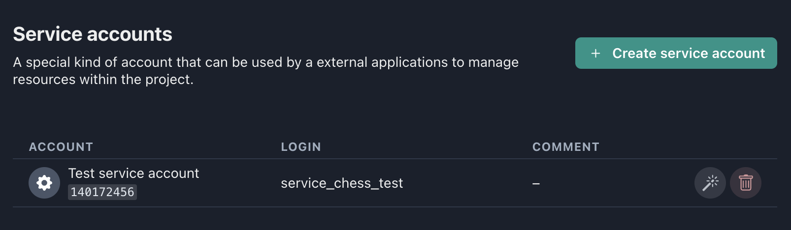
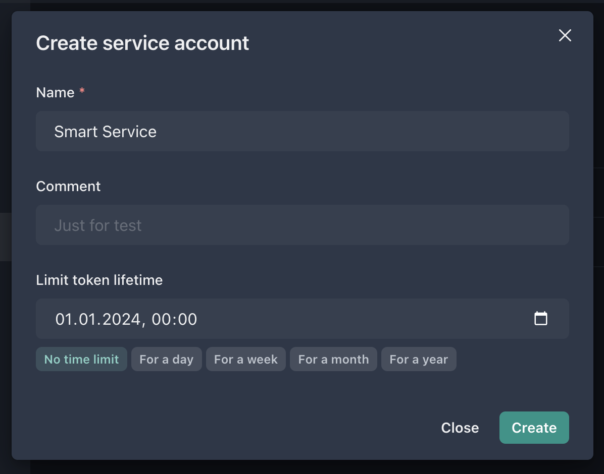
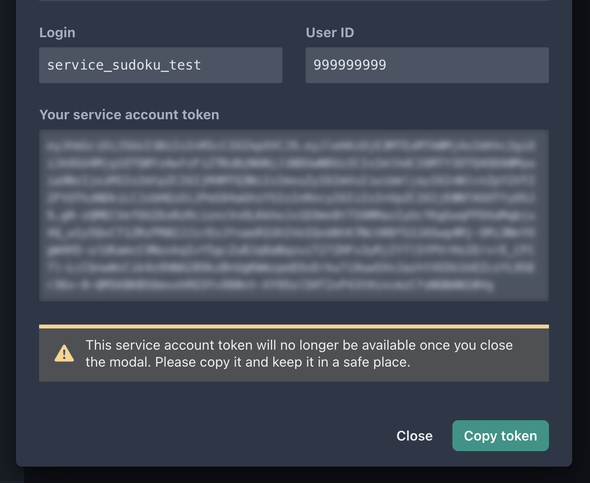

A service account is a special kind of account that can be used by a external applications or services to manage resources within the project. You can't use service accounts to log in to the system in the usual way. However, you can assign roles for these accounts, just as you do for regular users.

---

## Creating a service account

Press the **Create service account** button to create a new one.

When you create a new service account, you can specify a display name, comment, and its lifetime (e.g for one year). As a result of creating a service account, you will be issued a token that will allow you to make API requests on behalf of the account.

:::caution

For your protection, you should never share your token with anyone. If you have lost your token or it has been compromised, you can generate a new token for the account.

:::

## Generating a new token for an existing service account

If you need to generate a new token for an existing service account (e.g. in case your current token has been compromised), click **Generate New Token**. In the dialog box that opens, you can specify the lifetime of the new token.
