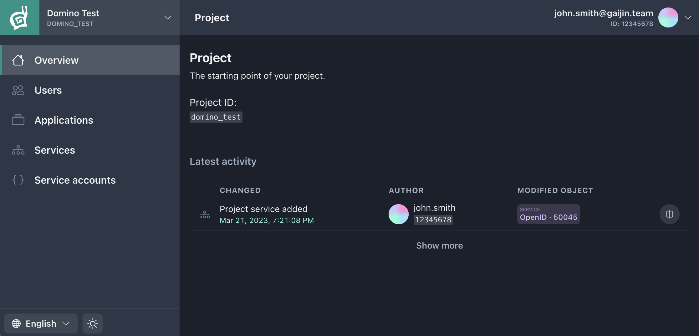
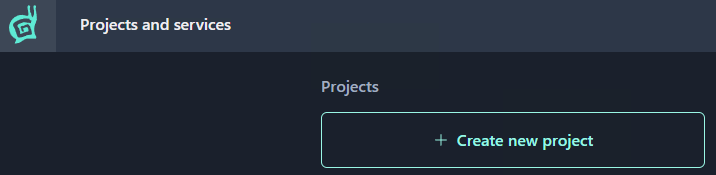

Project is the top-level entity for Gaijin Central. Key features of the project:

- Containing one or more [applications](applications.md). Application is a logical entity, allowing to break a project into separate subsystems. For instance, you can keep separate applications for different platforms or environments (test, production, etc.)
- Enabling to connect the necessary [services](services.md) depending on your needs.
- Allowing flexible access management for [administrators](project-administrators.md) to applications and services.

---

## Creating a new project

!!!note
    To create a new project, it’s required to have a two-factor authorization (2FA) enabled with a code generator application in your Gaijin account. This is an additional security measure that will help protect your account and prevent unauthorized access.

---

To register a new project:

1. Press the **Create new project** button on the **Projects and services** page (or press the same button in the [Start menu](getting-started.md#start-menu).)

!!!note
    To create a new project, it’s required to have a two-factor authorization (2FA) enabled with a code generator application in your Gaijin account. This is an additional security measure that will help protect your account and prevent unauthorized access.

2. Enter the project name (_Latin letters, numbers, and spaces are allowed_).

!!!note
    GAP will generate a project identifier automatically, based on the project name, making all symbols lowercase and replacing spaces with underscores. For the project named "Mind Games", the system will auto-generate the `mind_games` identifier.

xxxx

3. Press the **Create** button.

Done! The project has been created and you are its owner and administrator.

#### Possible next steps after creating an project:

- [Create an application](applications.md#creating-a-new-application) within the project
- Adding other [administrators](project-administrators.md) to the project
- Connecting [services](services.md)
