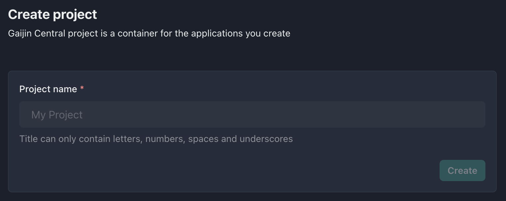

Project is the top-level entity for Gaijin Central. Key features of the project:

- Contains within itself one or more [applications](applications.md). Application is a logical entity, allowing for breaking a project into separate subsystems (e.g. you can keep applications for different platforms or environments - test, production, etc)
- Ability to connect the necessary [services](services.md) depending on your needs
- Allows flexible management of access for [administrators](project-administrators.md) to applications and services

---

## Creating a new project {#new-project}

:::info

In order to create a new project in Central, it's required an enabled two-factor authorization (2FA) with code generator application in your Gaijin account. This is an additional security measure that will help protect your account and prevent unauthorized access.

:::

To register new project press the **Create new project** button on **Start page** or press the same button in [Start menu](getting-started.md#start-menu).

Then enter a name for the project (only latin letters, numbers, spaces and underscores are allowed) and press the **Create** button to complete the creation.

:::info

A project identifier will be generated automatically, based on the project name. All symbols will be made lowercase and spaces will be replaced with the underscore. Thus, for the project named "Mind Games" the `mind_games` identifier will be generated. Given ID are the truly unique identifiers for a project across all of Central.

:::

Done! The project has been created and you are its owner and administrator.

#### Possible next steps after creating an project:

- [Create an application](applications.md#creating-a-new-application) within the project
- Adding other [administrators](project-administrators.md) to the project
- Connecting [services](services.md)
