This page describes how to manage roles and permissions within your application.

**Note**: For information on the basic concept of roles and permissions within Gaijin Application Platform, refer to the [Roles and Permissions](../basic_concepts/roles-and-permissions_concepts.md) section.

## Managing an Application Schema

The application developer creates the **application schema**, which is a combination of permissions and roles.

### Adding an Application Schema

In the application, you can add each permission and role manually. However, it is much faster to import a ready-to-use schema, so that later you can edit it by adding more permissions and roles. You can also create your own application schema from scratch. To add a schema to the application:

1.	Click **Users** to open the **Application users** page.

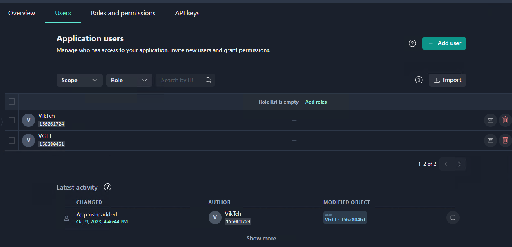

**Note:** There are no roles or permissions assigned to the users because no schema is defined for the application. 

2.	Open the **Roles and permissions** page. It is empty for now.

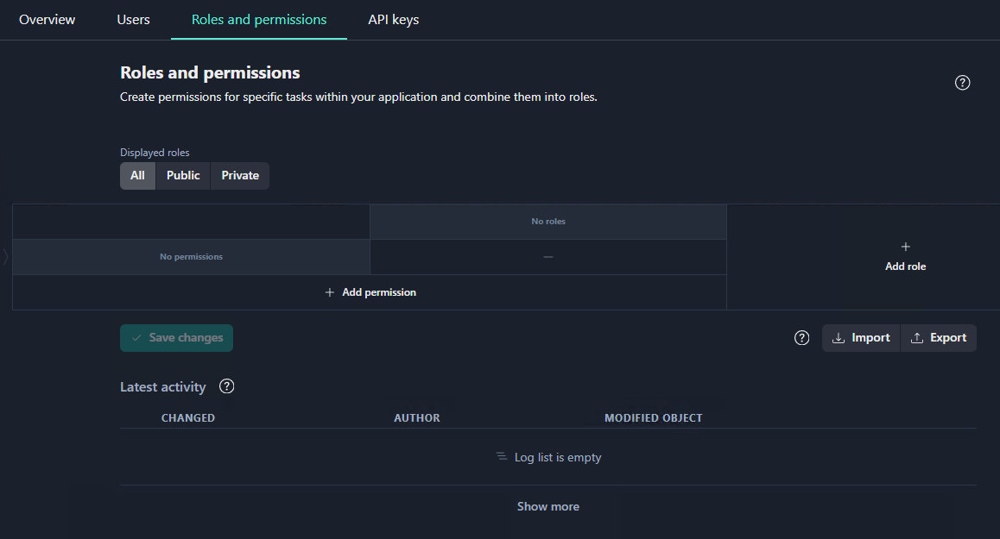


3. Press the **Import Data** button. This opens the form, enabling you to enter the application schema.

4. Copy and paste the sample schema into the form.


   <details>
     <summary>Sample schema</summary>

   ```json
   {
     "roles": {
       "moderator": {
         "name": "moderator",
         "description": "",
         "protected": true,
         "permissions": [
           {
             "name": "user.kick",
             "value": true
           },
           {
             "name": "user.mute",
             "value": true
           }
         ]
       },
       "lead support": {
         "name": "lead support",
         "description": "",
         "protected": true,
         "permissions": [
           {
             "name": "inventory.edit",
             "value": true
           },
           {
             "name": "inventory.view",
             "value": true
           },
           {
             "name": "user.ban",
             "value": true
           }
         ]
       },
       "god": {
         "name": "god",
         "description": "",
         "protected": true,
         "permissions": [
           {
             "name": "inventory.edit",
             "value": true
           },
           {
             "name": "inventory.view",
             "value": true
           },
           {
             "name": "user.ban",
             "value": true
           },
           {
             "name": "user.kick",
             "value": true
           },
           {
             "name": "user.mute",
             "value": true
           }
         ]
       }
     },
     "permissions": {
       "user.kick": {
         "name": "user.kick",
         "value": false,
         "description": "Can kick user from game session",
         "protected": true
       },
       "user.mute": {
         "name": "user.mute",
         "value": false,
         "description": "Can mute a  user permanantly or for limited time",
         "protected": true
       },
       "user.ban": {
         "name": "user.ban",
         "value": false,
         "description": "Can ban a user from the game login",
         "protected": true
       },
       "inventory.edit": {
         "name": "inventory.edit",
         "value": false,
         "description": "Can edit a player inventory content",
         "protected": true
       },
       "inventory.view": {
         "name": "inventory.view",
         "value": false,
         "description": "Can view a player inventory",
         "protected": true
       }
     }
   }
   ```

   </details>


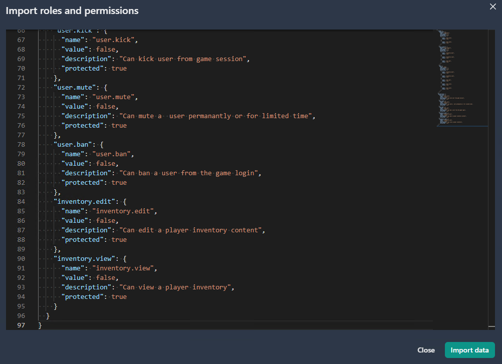

4.	Press the **Import Data** button. The application schema containing the permissions and is now displayed in the form of a table.

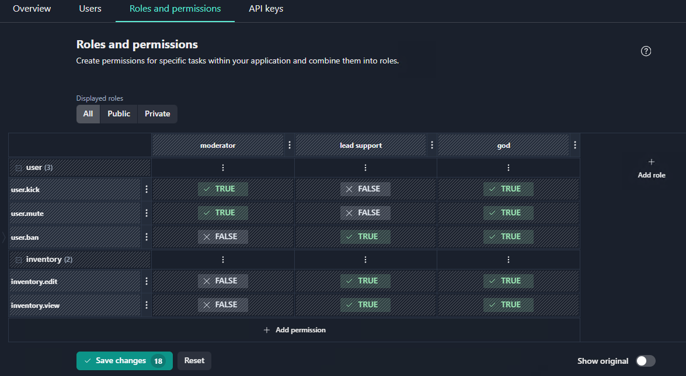

**Note:** In this example, the number 18 displayed on the Save changes button means that 18 edits have been made to the existing application schema.

6.	In the **Schema changes** screen, click **Apply**.

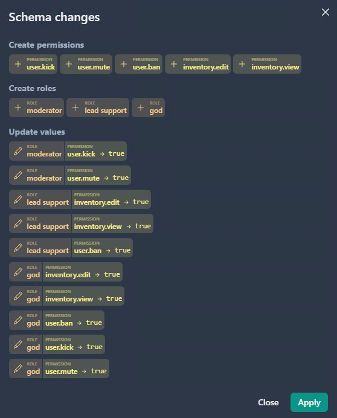

**Note:** Each time you manage application roles and permissions in Central, the application schema is changed.

### Adding a permission

To add a new permission, click the **Add permission** button at the bottom row of the table.

In the window that opens, enter the following:

- Name (required) – application-wide unique permission key. You can name permissions any way you like. 
 **Note:** You can start entering the permission name prefix by selecting the created permission group, as illustrated below.
- Description – a text field describing the purpose of the permission. 
- Default value – `TRUE` or `FALSE`. 


**Note:** For large schemas application, it is recommended using [grouping permissions feature](#grouping-permissions-feature) by entering prefixes in the name (e.g. using `<group>.<permission>` format).

### Editing permissions

To edit a permission: 

1.	Click three dots next to the permission you wish to edit and select **Edit permission**.

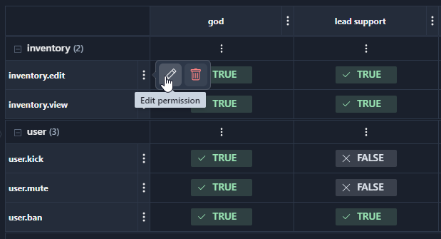

- You can edit the description. 
- By selecting the Default value slider button, you can change the permission default value from `FALSE` to `TRUE`.


**Note:** You are not allowed to edit the names of already created permissions.

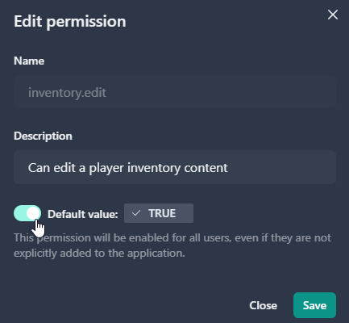

2.    Click Save. 

### Creating a role

To create a new role:
1. Click the **Add role** button at the right column of the table.

2. In the New role window that opens, enter the following information in the form:

- **Name** _(required)_ – application-wide unique role key
- **Description** – a text field describing the purpose of the role
- **Public role** flag – if selected, the role will be available for selection as a project role

3.	Click **Create**. The newly created role is now added on the **Roles and Permissions** page.

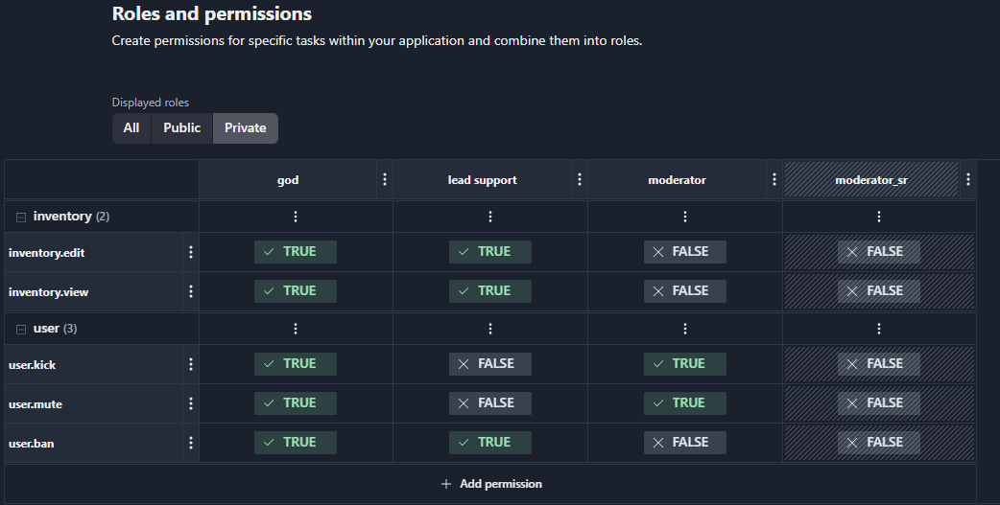


### Setting permissions for roles
You can set the value of each permission within a role in the table by selecting the corresponding cell.

1.	Click each required cell repeatedly. This will change the value in the cell toggling between `TRUE`, `FALSE`, and `default`.

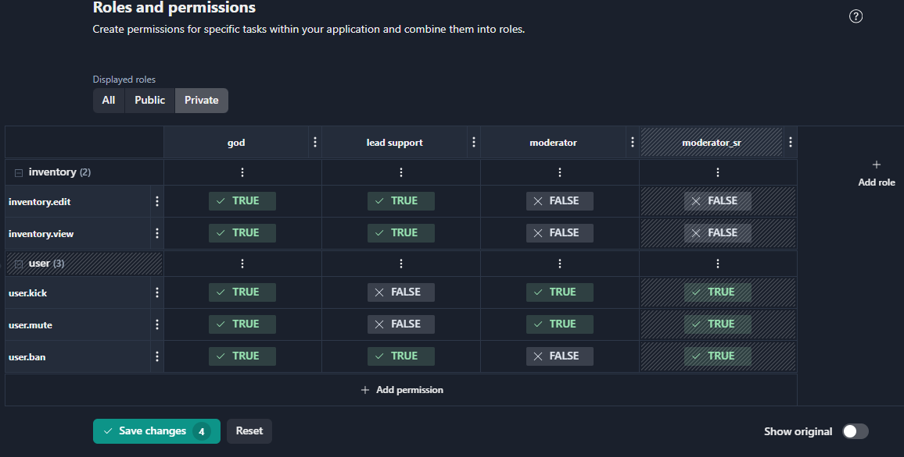

2.	Click the **Save changes** button. Once you click **Save changes**, the system will present a summary of the updates.

**Note:** Clicking **Reset** will rollback your edits. Selecting **Show original** enables you to view of the table before the changes made.

3.	In the **Schema changes window**, click **Apply**. This will save changes to the server.

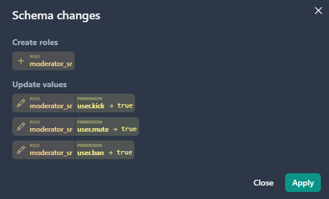

### Grouping permissions feature

Central enables a developer to logically organize permissions in the Roles and Permissions table. This feature is especially helpful for large schema applications.

**Note:** Any permissions group can be collapsed or expanded in the user interface; you can make edits to the schema for the entire group at once.

To combine a set of permissions into a logical group, you specify a permission name in the format `<group>.<permission>`.

For example, the schema may have the permissions named `inventory.edit` and `inventory.view`. This will place the `edit` and `view` permissions in the `inventory` permissions group when displayed on the application permissions list.

Any permissions group can be collapsed or expanded in the user interface; you can make edits to the schema for the entire group at once.

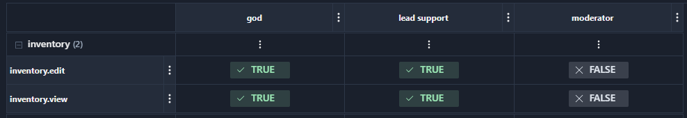

**Note:** Using the grouping notation `<group>.<permission>` does not impose any additional functionality in Central. This feature only provides the convenient way to structure schema permissions displayed on the application permissions list.

!!!warning
    If you group permissions using the `<group>.<permission>` notation, the prefix name cannot be the same as the name of an individual permission. For example, you cannot use `inventory` and `inventory.edit` permissions in the schema at the same time. This applies to permissions of any nesting level.

### Assigning roles to application users

When the application schema is ready, you can assign roles to application users. To assign roles:
1.	Click **Users** to open the **Application users** page.

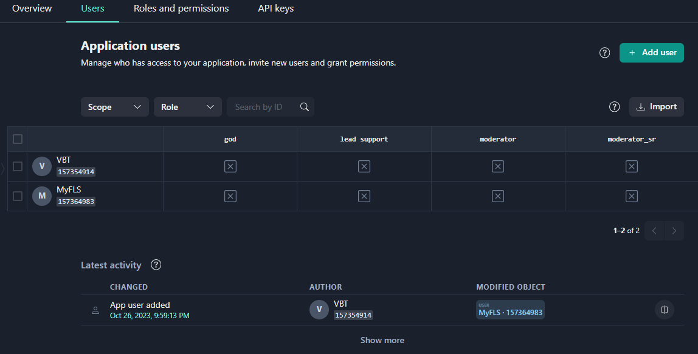

2. Select the check boxes in the cells to assign one or more required roles to each user.

3. Click Save changes.


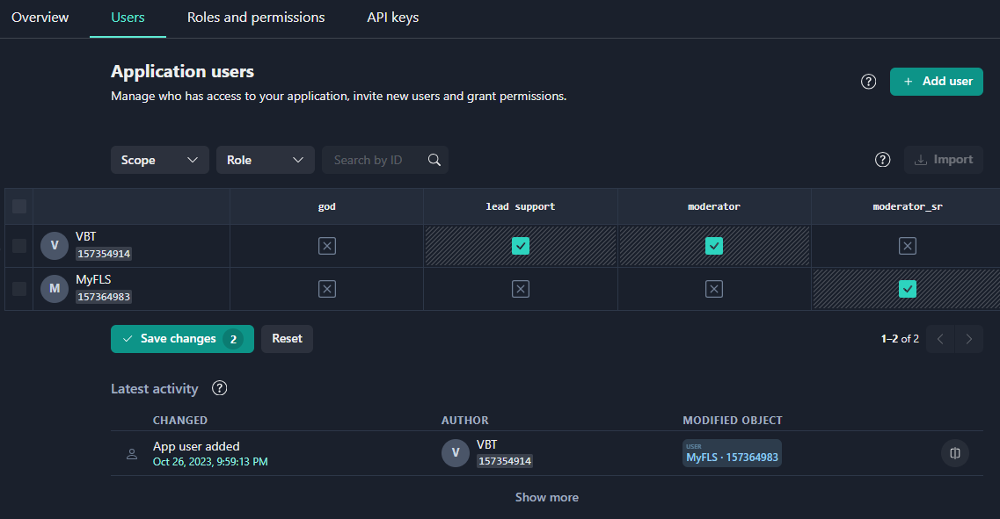

4. Click Apply in the **User access changes** window.

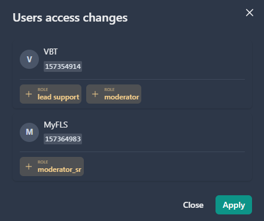


### Assigning multiple roles

Roles combine permissions according to a particular business task. There can be dozens of separate permissions within a single application. Since you can assign several roles to a user, you don’t need to create many complicated roles. 

Instead, it is much better to create several roles complementary to each other and assign a necessary role combination to a particular user. This enables administrators flexibly to add (or remove) a permitted task to a role assigned to multiple users.

For example, you created the Moderator role and assigned it to the number of users. If later you decide to grant all moderators with the ability to ban players, you just need to add the `user.ban` permission to the Moderator role. Any user with the Moderator role will automatically get the ability to ban players.


## Setting temporary roles

If you need to assign a role not permanently, but temporarily, you can limit its lifetime. 


To set a period of role validity:

1. Click the **Limit role** lifetime icon.

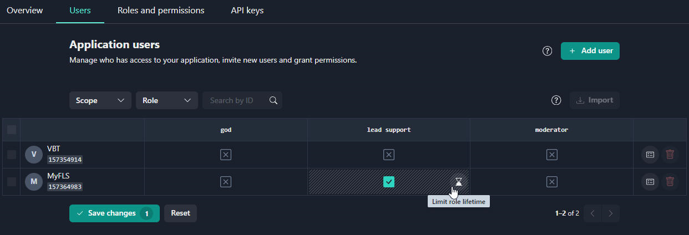

2.	Select the validity period and click **Save**.

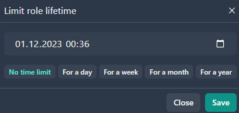


## Editing roles

To edit a role:

1.	Click three dots next to the role and select the **Edit role** icon.

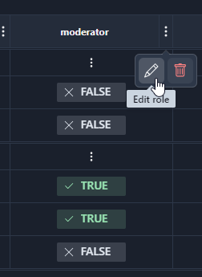

2. In the **Edit role** window, you can edit the role description. 
**Note:** You are not allowed to edit the names of already created roles.

2.	Click **Save**.

## Applying changes to schema 

The system keeps track of changes you made to roles and permissions, but it will save them to the server only after you apply the changes to the application schema. 

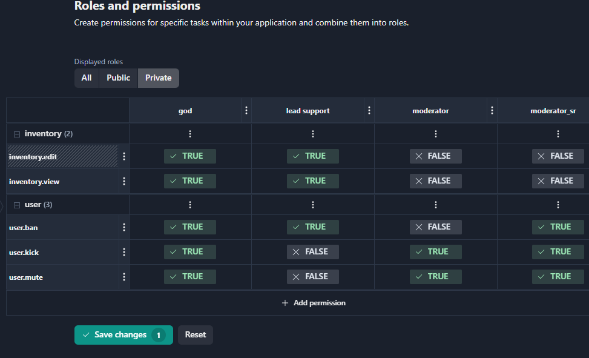

The **Save changes** button displays the edit counter, showing the number of edits performed on the schema.  A special shading highlights the changed fields on the table.
You can also rollback edits by pressing the **Reset** button. To view the table before the changes made, select the **Show original** slider button.

To apply schema changes:
1.	Click the **Save changes** button. The **Schema changes** window will show an overview of the changes (added, deleted, changed roles and/or permissions, updated values).
2.	Click the **Apply** button. This will save these changes to the server.

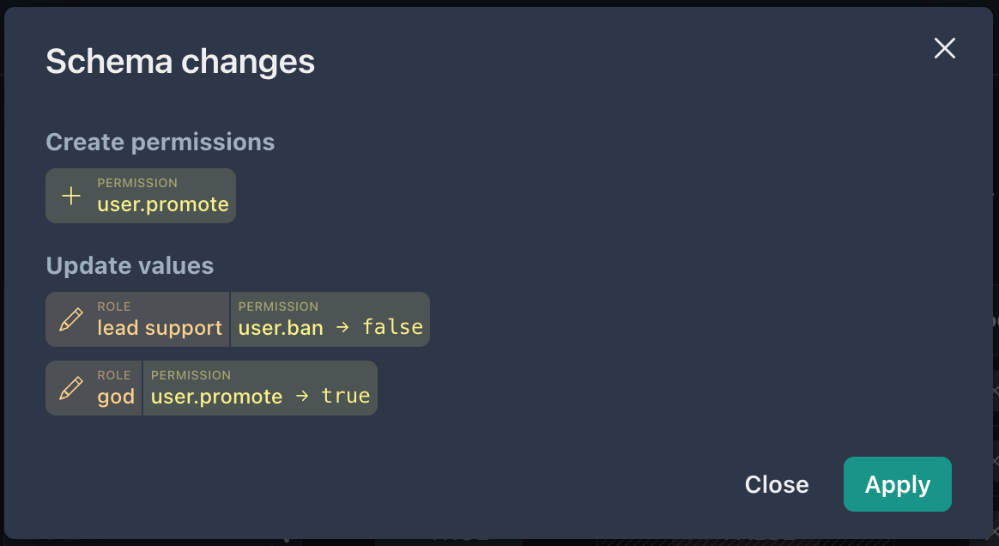

## Exporting an application Schema

Central enables you to export an entire application schema or a part of the schema by selecting necessary roles and/or permissions. 
To export an application schema:
1.	Open the Roles and permissions page for your application.
2.	Click the Export button.

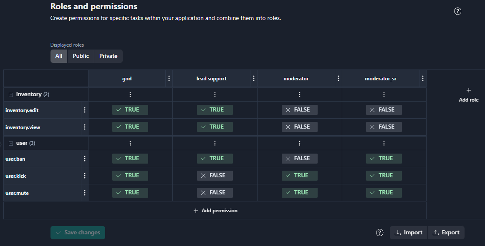

3.	The Export roles and permissions window contains a list of roles and permissions available for selection. In the Export roles and permissions window, select the roles and permissions you wish to export.

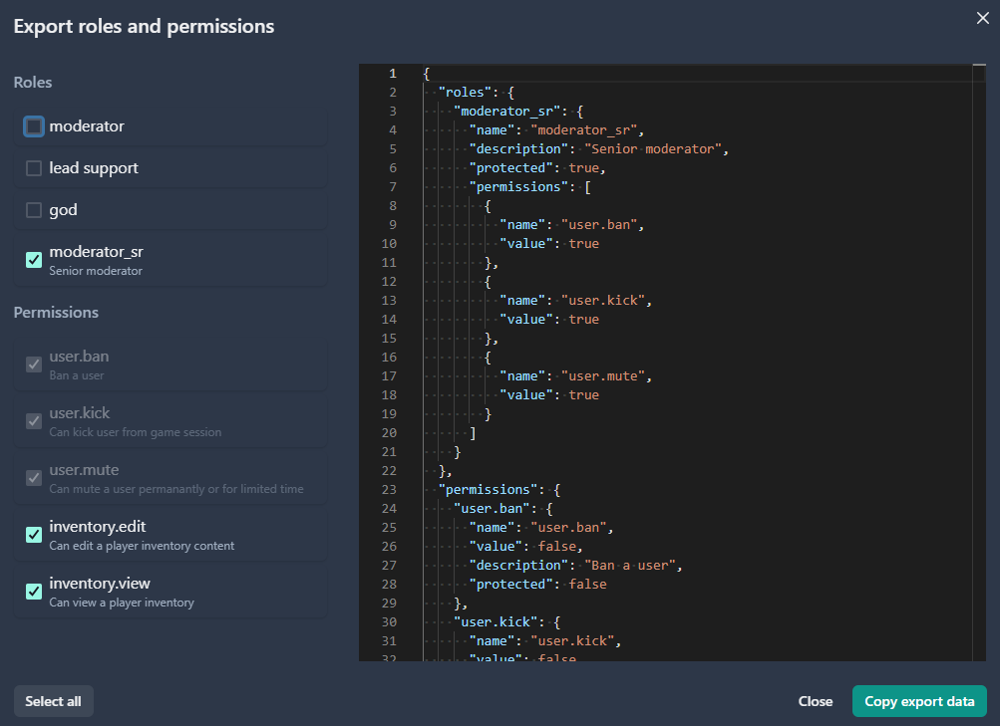

Note that when you select a role for export, the system automatically selects the permissions related to that role, and you cannot exclude them. When you select roles and/or permissions, the auto-generated Json data for export is displayed in the right part of the Export roles and permissions page.

4.	Click **Copy export data**.
This will copy data to the clipboard, making it available for a developer. Then you can import this schema from the clipboard into another application. 

