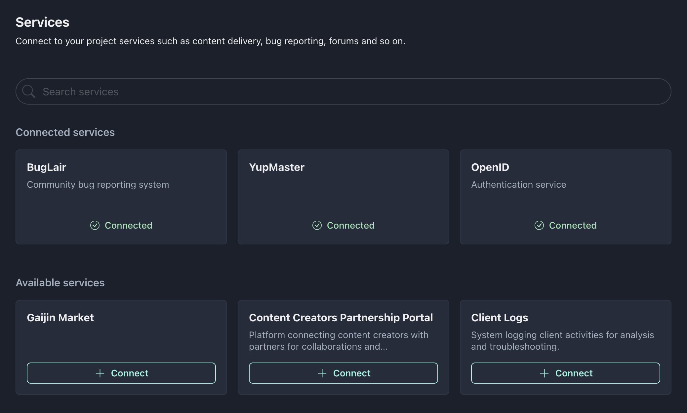
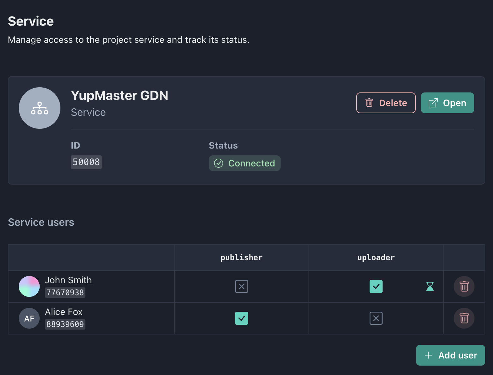

Gaijin Application Platform allows administrators to expand the functionality of their applications by connecting additional services, such as content delivery, matchmaking, leaderboards, inventory, bug reporting, forums and so on.

---

To connect a service to the project, go to Services in the [Side navigation](getting-started.md#side-navigation). This page contains a list of available services for your project, as well as a list of already connected services. The list of available services will expand over time.

The **Connect** button will add the selected service to your project.

Depending on the service, installation may take some time. Detailed information about the progress of the installation or the causes of the error can be found in the **Status** field on the service page. However, most services install instantly.

## Service page

The following is displayed in the service card:

- Service **name** and **description**
- **Delete** button - removes the service from the project
- **Open** button - opens the service in a new window and automatically logs in (if the service supports it)
- Service **ID**
- Installation **status**. Possible service installation statuses:
  - Connected
  - Setup in progress
  - Error occurred (in this case the reason will be displayed when you hover the cursor)

### List of users

The page provides a access table to the service that consists of rows and columns, where each row represents a **user** and each column represents a **role**. The purpose of an access table is to define which users have access to specific roles within a service. Each cell in the table represents whether a particular user has been granted access to a specific role, with a value of `TRUE` or `FALSE`. As with the application access table, service roles can also have a time limit.

### Adding new users

The **Add User** button will open a modal window with `user_id` input. If the user is successfully found, the information about him will be displayed below and the **Continue** button will become active.

There is also an option to use your `user_id` when you click the **Select yourself** button.

The next step will display a modal window with a choice of roles for the new user. It is necessary to check **at least one role** for the user to add him to the service. It is also possible to specify the time limit for which this role should be set.
