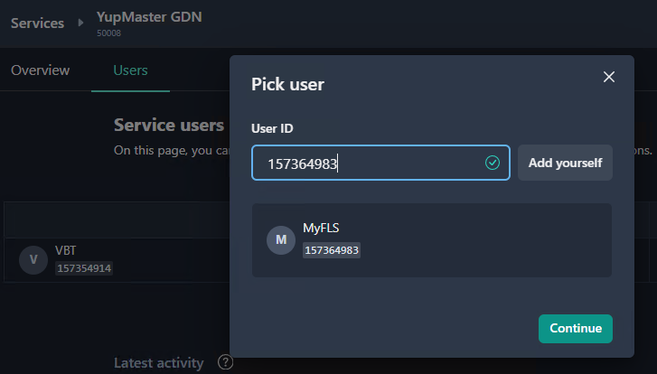
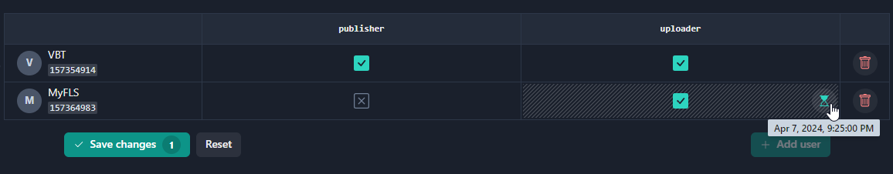

Gaijin Application Platform allows users with administration rights to expand the functionality of their applications by connecting additional services, such as content delivery, matchmaking, leaderboards, inventory, bug reporting, forums, and so on. When necessary, these services can be connected to the project. GAP offers a range of available services, including the `YupMaster GDN`—the content delivery service.

The steps for connecting and configuring a service to a project are as follows.

1. The project administrator connects the service to the project.

2. The project administrator assigns the service administrators. Project administrators do not have service administration rights by default, but they can appoint themself to be a service administrator.

3. The service administrator assigns users and their roles within the service and makes any other service configurations.

# Connecting a service to a project

To connect a service to the project, go to `Services` in the [Side navigation](getting-started.md#side-navigation). This page contains the list of services available, as well as the list of services that are already connected in your project.

The `Connect` button adds the selected service to your project.

Service installation time depends on the service size. While most services install almost instantly, installation of large services may take some time. You can find detailed information about the progress of the installation or the causes of the error in the `Status` field on the service page.

# Service page

The `Overview` tab opens the `Service` page that contains the service card and the list of service administrators.

The service card displays the following information:

- Service `name` and `description`
- `Disconnect` button - removes the service from the project
- `Open` button - opens the service in a new window and automatically logs in (if supported by the service)
- Service `ID` - the unique service number
- Installation `status` - the status of service installation. Possible service installation status values:
  - Connected
  - Setup in progress
  - Error occurred (hover the cursor to see the error reason)

The `Administrators` panel contains the list of service administrators that can manage users of the service. The `Add administrator` button enables the user with project administration rights to add a service administrator.

!!!note
    Disabling a service will revoke all roles assigned to users and invalidate secret keys (if any) used for the service integration. After reconnecting, you must perform all the configurations again.

# Connecting users to the service

Clicking the `Users` tab opens the `Service users` page, listing the users connected to the service. The page contains the users’ access table that has rows and columns, where each row represents a user and each column represents a role. The purpose of the access table is to define which users have access to specific roles within a service. Selecting the check boxes in the table, a service administrator grants a specific user with access to a particular role.

## Adding new users

To add a new user to the service, perform the following steps.

1. Click the `Add User` button. This will open a modal window with the `user_id` input field.
2. Enter the user id. If the system successfully finds the user, it will display the user information in the panel below and activate the `Continue` button.

You can click the `Select yourself` button to enter your user id.

2. The next step will display a modal window with a choice of roles for the new user. It is required to assign **at least one role**. In the Select roles window, check the required user roles and click `Add user`.

## Setting temporary roles within a service

Optionally, you can specify the duration for which the user role is valid for the service. Here, the system will automatically revoke the role at the expiration time.

To specify a lifetime limit for a role:

1. Place the cursor in the corresponding cell and click the `Limit role lifetime` icon.

2. Set the role expiration time. You can click on the corresponding button or select the expiration time from the calendar.

3. Click `Save`.

Hovering the cursor over the icon will display the expiration time for the role.

