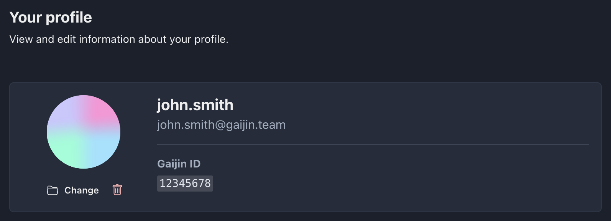

This section provides general account information such as login, email, and user ID. Additionally, users have the option to change or delete their avatar.

---

You can open the profile page from the [Account menu](getting-started.md#account-menu).

The page contains common information about user:

- **Username**
- **Login**
- **Gaijin ID** (`user_id`)

You can also upload or delete your avatar.

:::info
Project owners and administrators can specify a custom display name within a particular project. This action does not affect your profile.
:::
