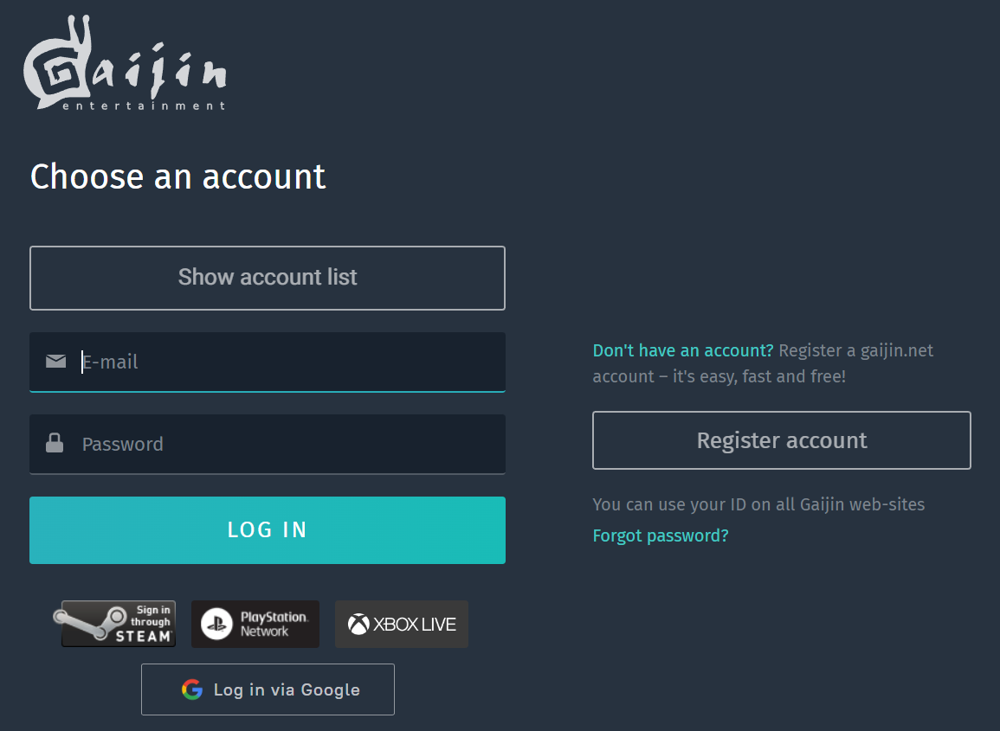
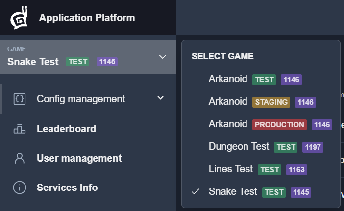

# Dev Portal Getting Started

## Login

First of all you must login to the Dev Portal(https://dev-portal-next.gaijin.net) using account that has some roles in the Dev Portal service.

If you don’t have any account, please [create new one](/#requirements).
To connect Dev Portal as service read [how to connect services and set user roles](../newcomers-guide/services.md).

## Main menu

After login, you can choose the game.

After that, you can use main menu to work with game configs, see leaderboards, see and change players profile, etc.

- [Config management](gui/configs-management.md)
- [Leaderboard](gui/leaderboard.md)
- [User management](gui/user-management.md)
- [Services Info](gui/services-info.md)
