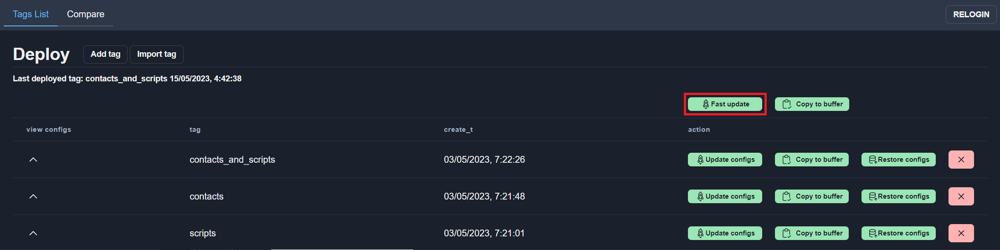
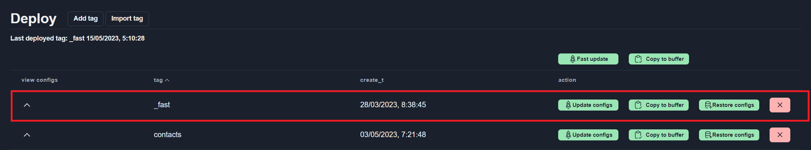
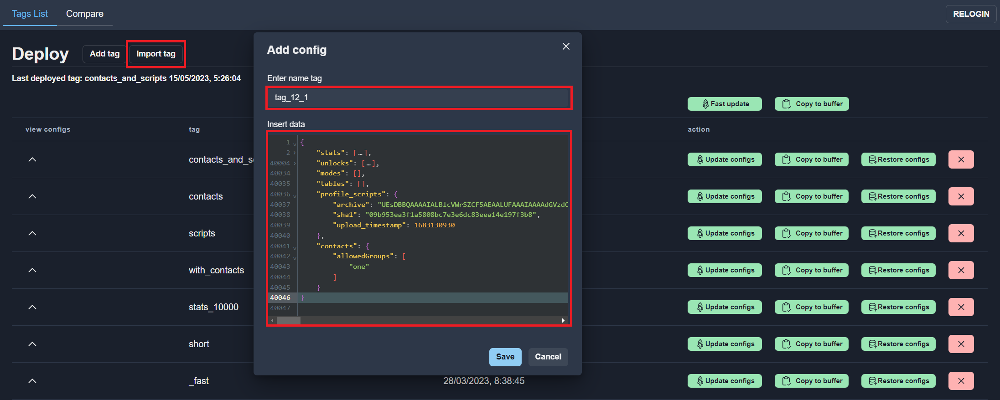

# Config Management  

Config Management – the general tab for working with game services configs.  

It contains tabs with all game configs and [deploy](#deploy-configs) tab.

## Config list

There are different types of configs:

[Multi element configs](#multi-element-config):
* Stats        [(see format)](../configs-format/stats-config-format.md)
* Unlocks      [(see format)](../configs-format/unlocks-config-format.md)
* Modes        [(see format)](../configs-format/modes-config-format.md)
* Tables       [(see format)](../configs-format/tables-config-format.md)

[Single configs](#single-config):
* Contacts     [(see format)](../configs-format/contacts-config-format.md)

[Scripts configs](#scripts-config):
* Scripts      [(see format)](../configs-format/profile-config-format.md)

### Multi-element config
Multi-element config contains array of similar elements, like stat, unlock, table, etc. All multi-element configs are editing in one way.  
Consider stat config editing:

#### Adding new config element
For adding new config element, click button with “Add” text. After click a new config element will be added.  
New config element automatically filled with default parameters.

You need to fill the name field and press save button. Also you can change another fields.  

!!!warning
    The changes aren't saved until Save button not pressed. If page reload all unsaved changes will be missed.  

#### Deleting element
To delete config element, click Remove button. Then you must confirm your action in the modal window.  

#### Editing element
To edit config element, use [Code Editor](#code-editor).  

To open Code Editor for Config element, click to arrow in the Code Editor column.  

Data are edited as in a regular text editor, with [code-complete](#code-complete), [errors marker](#errors-marker) and [changes marker](#changes-marker)  

### Single config
Single config is a json object which may contains fields with different type.  
To edit single config use [Code Editor](#code-editor).

Data are edited as in a regular text editor, with [code-complete](#code-complete), [errors marker](#errors-marker) and [changes marker](#changes-marker)  

### Scripts config
Profile server use scripts configs on [daScript](https://dascript.org/) language.
More information about [script config format](../configs-format/profile-config-format.md).

#### Upload/Download scripts archive
To upload scripts use zip archive containing folder with scripts.  
You must create zip archive by you self and than upload it using `Upload Zip` button.  
You can download scripts zip archive using `Download Zip` button.  

### Code Editor
#### Code Complete
Code completion allows complete all fields for config element or prompts the possible values.  
To initiate code compleate press `Ctrl+Space`  
Field name code complete:

Value code complete:

#### Errors marker
If Configs editor contains errors the Save button is disabled. Line with error marked with a red circle.  
To read the error message move mouse arrow over the red circle.

#### Changes marker
Changed parameters marked with a special symbol (pencil) for simpler tracking changes.

## Deploy configs
To deploy configs to the services use Deploy menu item.

  

The deploy window has 2 tabs:
* Tags List
* Compare

### Tags List
Еag list tab provides an interface for working with tags: adding tags, uploading configs from tag, exporting data from tag, etc.
  

#### Fast deploy configs
The easiest way to deploy configs to services is `Fast update`.  
  
This will directly upload current configs to services, just like from a master in git.  
Fast update automatically create special tag `_fast`. This tag rewrite each time you use `Fast update`.  
  

'Fast update' is useful on test circuit, but this is not good idea for production.  
The best way - save the configs in a tag first, as add git tag. And then deploy to services from tag.  
In the future, you can reuse this tag, for deploy or restore configs from it.  

#### Add new tag
To add new tag from current configs press `Add tag`.  

!!!note
    Tag name must be unique.

  

#### Deploy configs from tag
To deploy configs from tag click `Update configs` button and than confirm deploy:  
  
You can see updates progress information after launching the update for any configs:  
  
Last deployed tag shows in the top of the table:  
  

#### Import tag
Also you can import configs, press `Import tag` button. Set the tag name and paste configs text to the modal window:  
  

#### Copy configs to buffer
To get configs from tag use `Copy to buffer` button:  
  
Also you can copy to buffer current configs:  
  
This is useful to transferring tags between different game environments(test, staging, production) or between different game.

#### Restore configs from tag
You can replace all current configs to configs from tag, just press 'Restore configs` button:  
  

#### View tag configs
Click to arrow button to display tag configs:  
  
 
### Compare
Select "Compare" tab to view diff between 2 tags:  
  
Choose Before and After tags:  
  
You can see the difference in this section after clicking on the block with changing:  
  
A large number of equal lines are hidden in differentials. If you want to see more equal rows, select the value in the context selection:  
  
