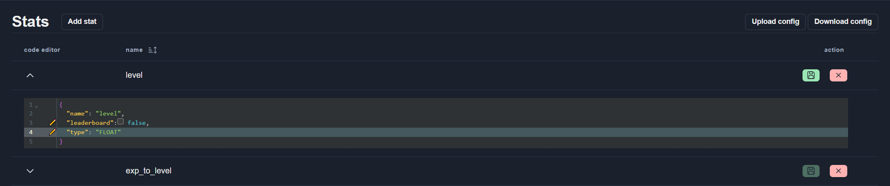
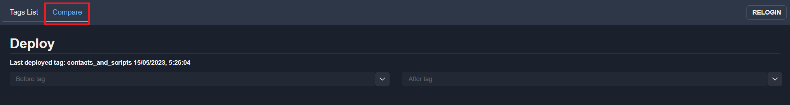

# Config Management

Config Management – the general tab for working with game services configs.

It contains tabs with all game configs and [deploy](#deploy) tab.

## Config list

There are different types of configs:

[Multi element configs](#multi-element-config):
* Stats        [(see format)](../configs-format/stats-config-format.md)
* Unlocks      [(see format)](../configs-format/unlocks-config-format.md)
* Modes        [(see format)](../configs-format/modes-config-format.md)
* Tables       [(see format)](../configs-format/tables-config-format.md)
* Triggers
* Items

[Single configs](#single-config):
* Contacts     [(see format)](../configs-format/contacts-config-format.md)
* Externals

[Scripts configs](#scripts-config):
* Scripts      [(see format)](../configs-format/profile-config-format.md)

### Multi-element config
Multi-element config contains array of similar elements, like stat, unlock, table, etc. All multi-element configs are editing in one way.
Consider stat config editing:

#### Adding new config element
For adding new config element, click button with “Add” text. After click a new config element will be added.
New config element automatically filled with default parameters.

You need to fill the name field and press save button. Also you can change another fields.

:::caution
The changes aren't saved until Save button not pressed. If page reload all unsaved changes will be missed.
:::

#### Deleting element
To delete config element, click Remove button. Then you must confirm your action in the modal window.

#### Editing element
To edit config element, use [Code Editor](#code-editor).

To open Code Editor for Config element, click to arrow in the Code Editor column.

Data are edited as in a regular text editor, with [code-complete](#code-complete), [errors marker](#errors-marker) and [changes marker](#changes-marker)

#### Common actions for config elements
You can change some config elements and save it by the click to button “Save all”

To edit the common values ​​of several config elements, select them by checking the appropriate checkboxes

Click on the “Change selected” button. In the window that opens, edit the necessary values.

To remove a config parameter, use the parameter with value `null`

To delete selected elements click to button “Delete selected”

You can upload config from file and download to file with buttons “Upload config” and “Download config”

#### Filters
To open the string input for filtering, click the button with the filter icon.

Filters available values:
Equality/inequality - matches records where value of the field is equal/unequal to specified value, ex.: `foo=42, foo!=-3.14, foo!="a string", foo=true, foo=false`
Regex - if field value is a string, matches it against specified regex, ex.: `foo=/^https?:\/\// foo=/^https?:\/\//`
Comparison `(<, >, <=, >=)` - if field value is a number, compares it with specified value, ex.: `foo>42, foo<=-3.14`
Presence - matches records where specified field is present/missing, ex.: `foo exists, foo !exists`
Array - matches records where the value of a field equals to any value in the array, ex.: `foo in [42, -3.14, "bar", true, false]`
Complex queries can be constructed using logical AND (&) and OR (|) operators, ex.: `foo=42&bar exists`
Filters can be grouped by parenthesis, ex.: `foo=42&(bar exists|foo<100)`
Operator precedence (from highest to lowest): `(), &, |`
Spaces may be omited where possible: `foo = 42 & bar in [1, 2, 3] | baz exists` is equivalent to `foo=42&bar in[1,2,3]|baz exists`
Array may have trailing comma: `[1, 2, 3,]` is equivalent to `[1, 2, 3]`
To search by date, use the timestamp format `create_t=1708437468`

You always can use clue to watch filters available values

To filter by dates you need to use timestamp format. To get date in timestamp format click to button into configs row beside data value.

The date in timestamp format will be copy to clipboard and you can use it in filters.

#### Namespaces tabs
List of enable tabs with namespace is shown on the top of the config's page.

To show elements matching the needed namespace click to the tab.
To add a new config tab - click of the button “Add namespace”. Input unique name for a new tab and click to the “Ok” button:

You can delete new tabs, before they are not contained elements.

To change the namespace for some config element change field "namespace" in the Code Editor and save changes

The element will show in the correct tab:

### Single config
Single config is a json object which may contains fields with different type.
To edit single config use [Code Editor](#code-editor).

Data are edited as in a regular text editor, with [code-complete](#code-complete), [errors marker](#errors-marker) and [changes marker](#changes-marker)

### Scripts config
Profile server use scripts configs on [daScript](https://dascript.org/) language.
More information about [script config format](../configs-format/profile-config-format.md).

#### Upload/Download scripts archive
To upload scripts use zip archive containing folder with scripts.
You must create zip archive by you self and than upload it using “Upload Zip” button.
You can download scripts zip archive using “Download Zip” button.
You can upload configs from the directory using the “Upload from directory” button

Below the buttons the downloaded files are displayed in the form of a tree.

### Code Editor
#### Code Complete
Code completion allows complete all fields for config element or prompts the possible values.
To initiate code compleate press `Ctrl+Space`
Field name code complete:

Value code complete:

#### Errors marker
If Configs editor contains errors the Save button is disabled. Line with error marked with a red circle.
To read the error message move mouse arrow over the red circle.

#### Changes marker
Changed parameters marked with a special symbol (pencil) for simpler tracking changes.

## Deploy configs
To deploy configs to the services use Deploy menu item.

The deploy window has 2 tabs:
* Tags List
* Compare
* History

### Tags List
Еag list tab provides an interface for working with tags: adding tags, uploading configs from tag, exporting data from tag, etc.

#### Add new tag or update tag
To add new tag or update tag press “Add/Update tag”.
:::note
Tag name must be unique. If name isn't unique the tag will be overwriting.
:::

You can use current configs or import tag from data for fill tags.

#### Validate tag
To validate tag click to “Validate” button

You can validate all tag by one button “Valid all”

#### Deploy configs from tag
To deploy configs from tag click “Deploy” button and than confirm deploy:

:::note
Deploy button becomes enable after validation and if result of validation is Valid.
:::
You can see updates progress information after launching the update for any configs:

Last deployed tag shows in the top of the table:

#### Copy configs to buffer
To get configs from tag use “Copy to buffer” button:

Also you can copy to buffer current configs:

This is useful to transferring tags between different game environments(test, staging, production) or between different game.

#### Restore configs from tag
You can replace all current configs to configs from tag, just press 'Restore configs` button:

#### View tag configs
Click to arrow button to display tag configs:

#### Delete tag
To delete tag click to button

You can delete some selected tags with button “Delete selected”

#### Filters
To open the string input for filtering, click the button with the filter icon.

More information about [filters](../gui/configs-management#filters).

### Compare
Select "Compare" tab to view diff between 2 tags:

Choose Before and After tags:

You can see the difference in this section after clicking on the block with changing:

A large number of equal lines are hidden in differentials. If you want to see more equal rows, select the value in the context selection:

### History
Select "History" tab to view deploy history:

You can filter deploy history by tag names or time (from time/to time) or open the string input for filtering, click the button with the filter icon.

More information about [filters](../gui/configs-management#filters).