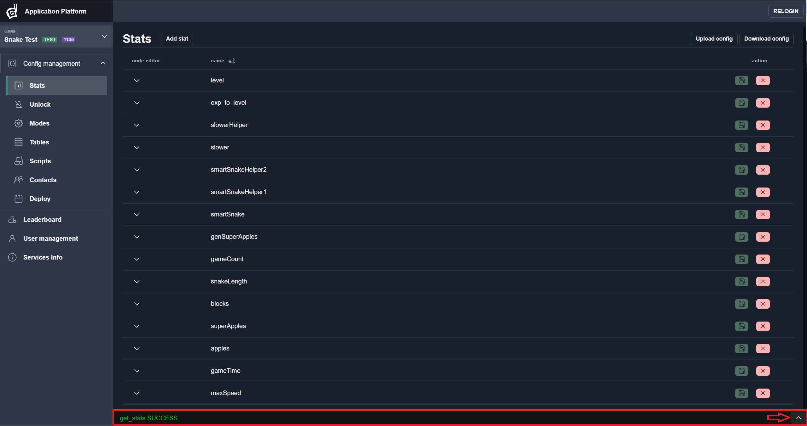
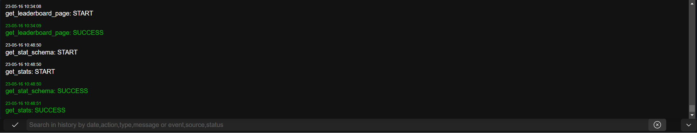
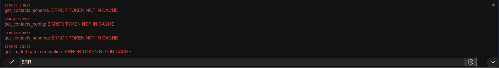
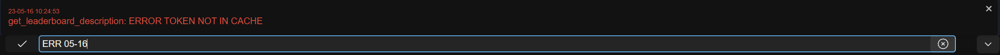
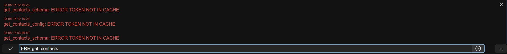
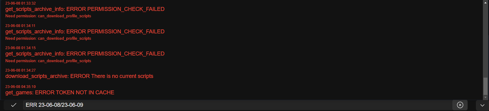
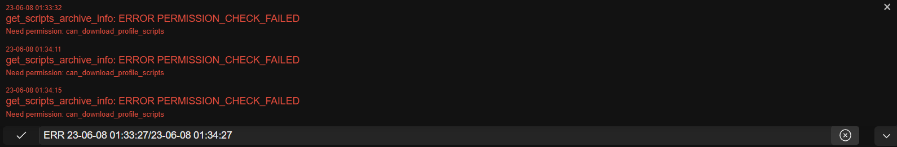

# Console
All action statuses indicating date and time of requests are written to the console.
To open console click `Arrow` button:

Now you can see last actions results. Console is scrollable.

### Console filter
You can filter console output, just enter a part of words separated by `Space` to filtering.
Data can be filtered by `date`, `action`, `type` and `error message`.
#### Filter errors
Input `ERR`:

#### Filter errors by date
Input `ERR ` and part of cureent date, for example: `ERR 05-16`:

#### Filter errors by action
Input `ERR ` and part of action name, for example: `ERR get_contacts`

#### Filter errors by date range
Input the `first date` and the `second date` separated by `/`, for example: `ERR 23-06-08/23-06-09`.

Add time for a more accurate filtering, for example `ERR 23-06-08 01:33:27/23-06-08 01:34:27`
