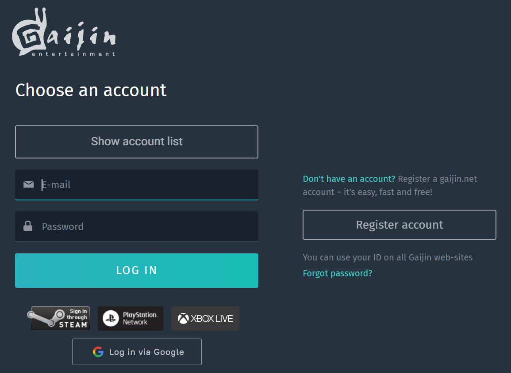

# Login
First of all you must login to the Dev Portal using account that has some roles in the Dev Portal service.  

If you don’t have any account, please [create new one](/).  
To connect Dev Portal as service read [how to connect services and set user roles](./../../newcomers-guide/services).  

# Main menu
After login, you can choose the game.

After that, you can use main menu to work with game configs, see leaderboards, see and change players profile, etc.

* [Config management](./configs-management)
* [Leaderboard](./leaderboard)
* [User management](./user-management)
* [Services Info](./services-info)