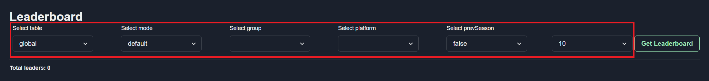
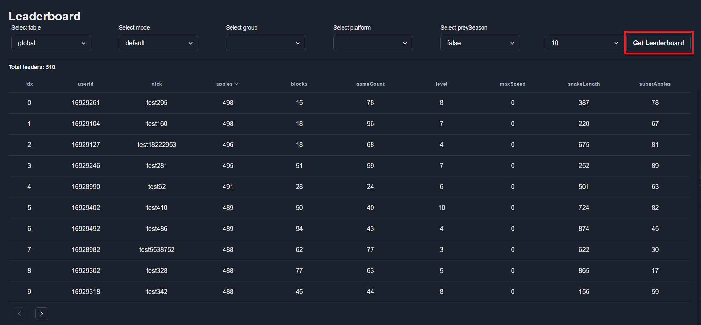
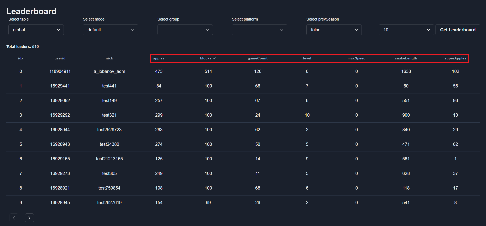
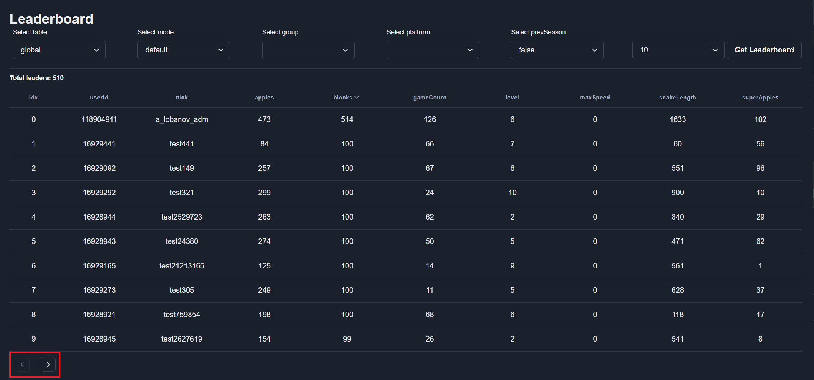

# Leaderboard
To see a leaderboard select appropriate menu item. Then select filter items:  

* table - leaderboard for specific table [more info](./../configs-format/tables-config-format)
* mode - leaderboard for specific mode [more info](./../configs-format/modes-config-format)
* group - special stat `__leaderboard` value. [more info](./../configs-format/stats-config-format#leaderboard-group).
  :::note
  If you don't use leaderboard group stay this field empty.
  :::
* platform - PC, Xbox, playstation.
  :::note
  If you not use leaderboard platform stay this field empty.
  :::
* prevSeason - use it if you want to see leaderboard for the previous season.
* count - the number of users on the leaderboard page.

After select filter press button `Get Leaderboard` to see the Leaderboard:  

To sorting the Leaderboard by various stat just click on column header:  

Use the navigation buttons to move to the next or previous page of the Leaderboard:  

