# User profile management
To see a user management info select appropriate menu item:
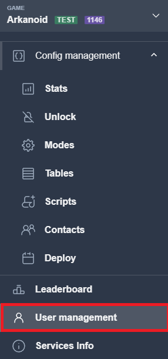

Input the userid at the field and press `View user profile` button:
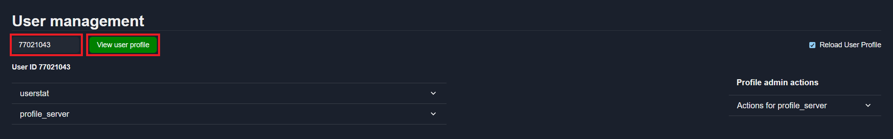

In User management window you can see sections with:
* User data
* Admin actions

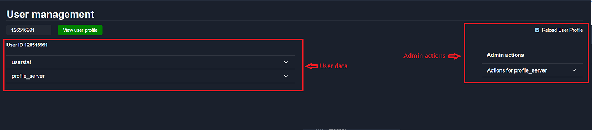

You can change width for actions block and data block with separator line:
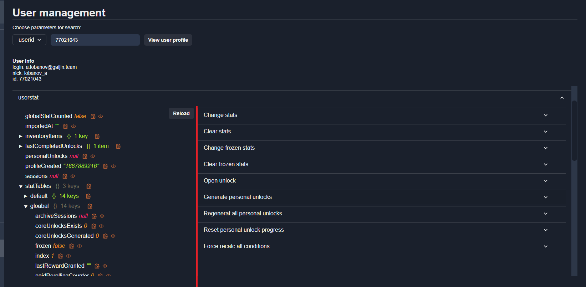

To select blocks to reload after sending actions use select block:
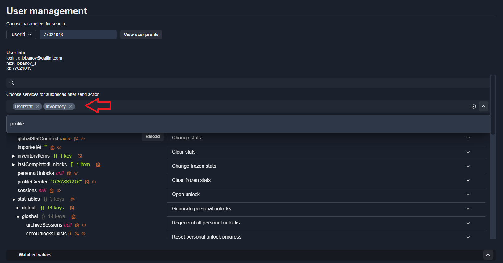

## User data
User data is presented as tree-view, and splitted by services(userstat, profile, contacts, etc.)
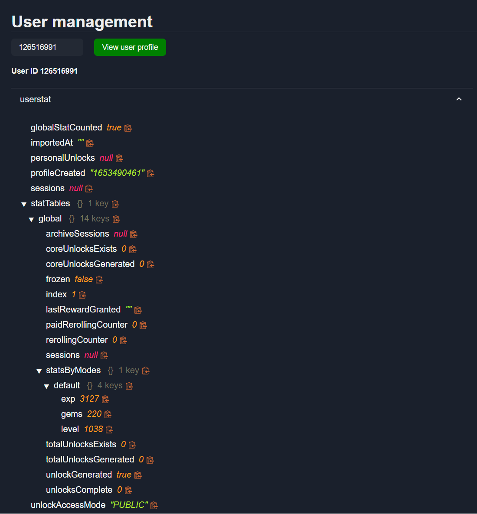

To reload user data and admin actions inside section click to Reload button.
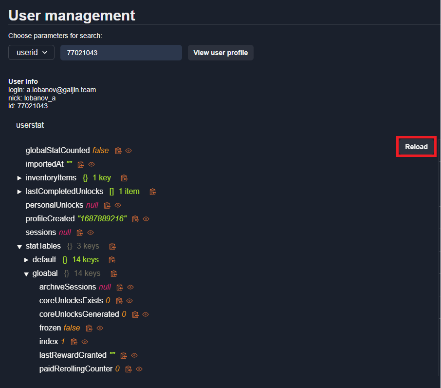

To copy any tree node value - click to `Copy Icon` next to the value:
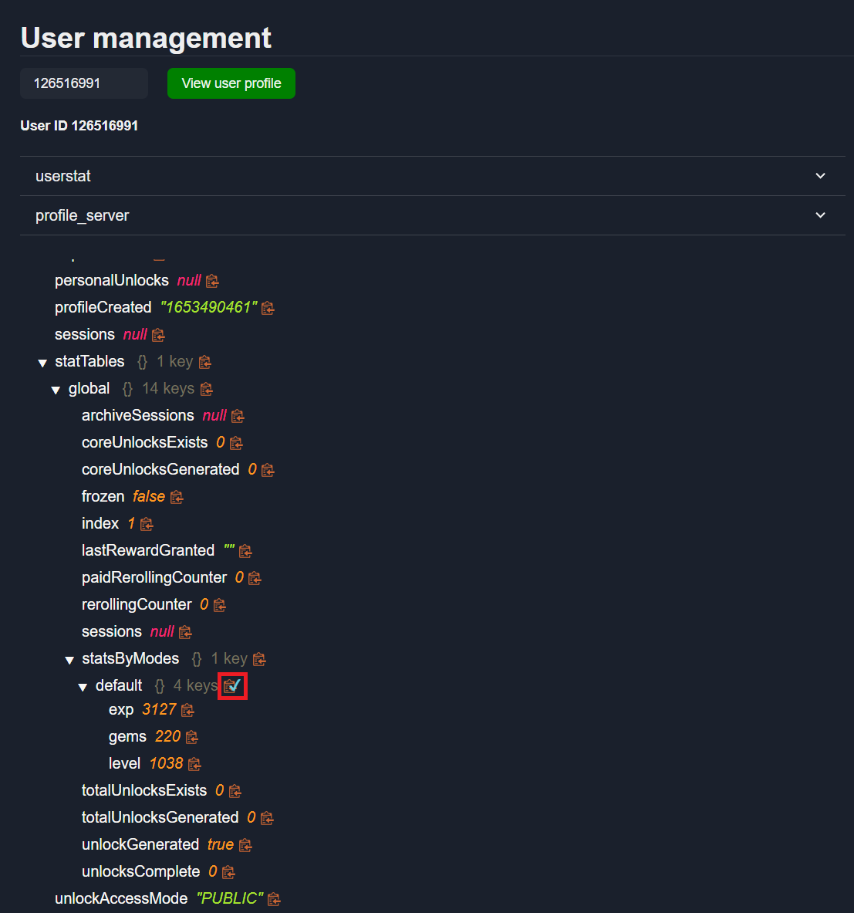

## Admin actions
There are relevant admin actions inside each services(userstat, profile, etc.)
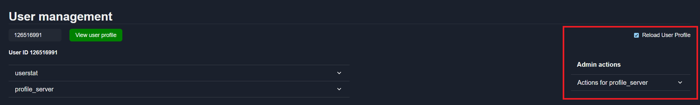

#### Profile admin actions
To use profile actions in admin panel you must add `admin_panel` tag in [action declaration on daScript](../configs-format/profile-config-format.md).
To use action set action parameters and press `Send action` button:
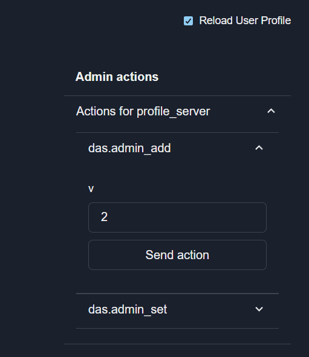

You can see action result in the console:
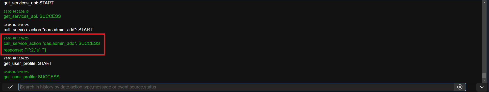

#### Watched values block
To add value to watched block click to the icon next to the value:
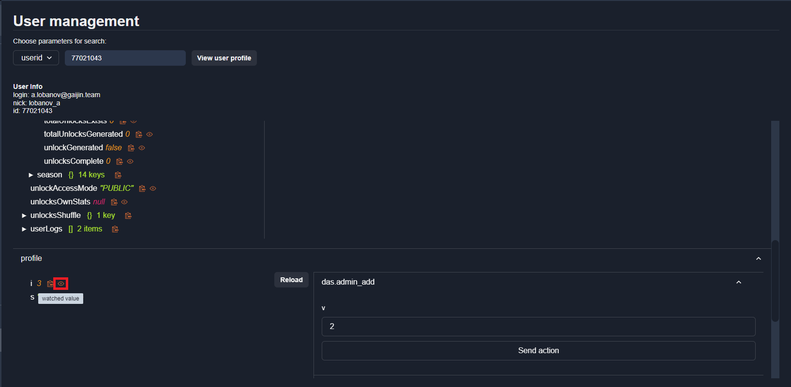

After added value you can watch it inside watched block:
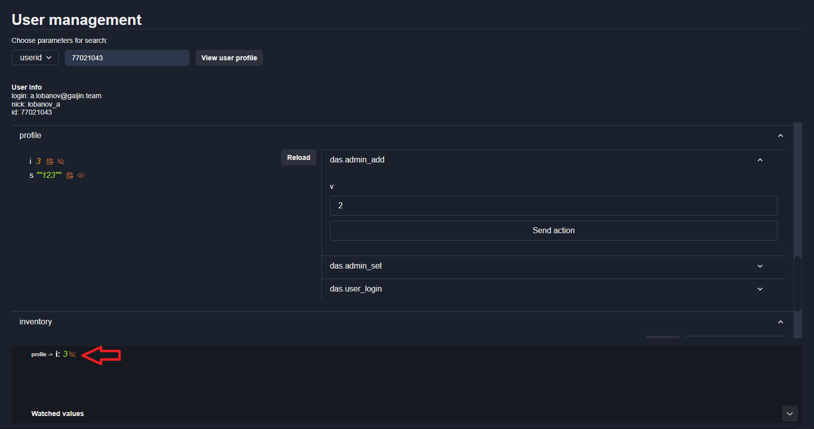

#### Userstat admin actions
Not supported yet, will be added nearest time.