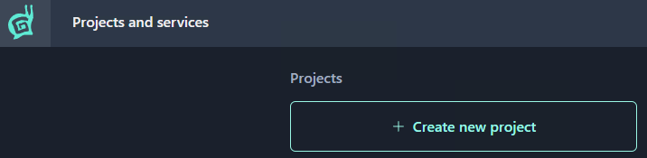
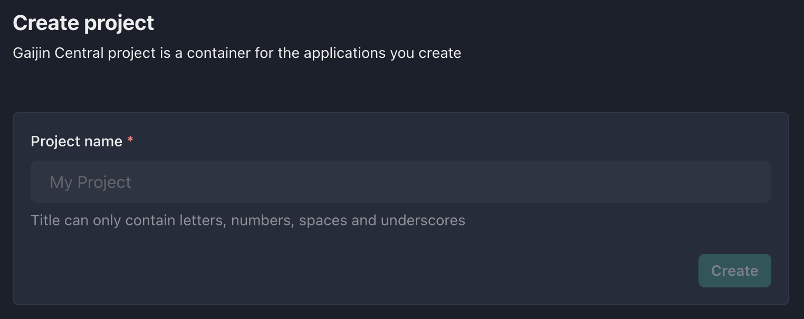
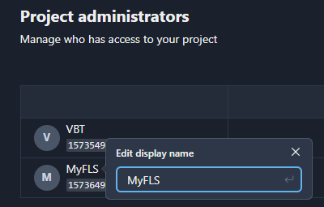

## New Project Registration

1. Go to [https://central-admin.gaijin.net](https://central-admin.gaijin.net/)
1. Press the **Create new project** button
    

    !!!note
        To create a new project, it’s required to have a two-factor authorization (2FA) enabled with a code generator application in your Gaijin account. This is an additional security measure that will help protect your account and prevent unauthorized access.

1. Enter the project name (_Latin letters, numbers, and spaces are allowed_)

    

    !!!note
        GAP will generate a project identifier automatically, based on the project name, making all symbols lowercase and replacing spaces with underscores. For the project named "Mind Games", the system will auto-generate the "mind_games" identifier.

1. Press the **Create** button

Done. You created the project, and you are its owner.

## Project Owners and Administrators

Having created a project, you can manage project users by adding project **administrators** and project **owners**. There can be multiple project administrators and owners, but at least one project owner. Administrators have full permissions within the project except for being unable to remove the project owner.
The difference between Project owner and Project administrator roles as follows: 

- **Project owner** - can only add (or remove) administrators and other owners.
- **Project administrator** - can manage any entity in the project, but not the owner.

For details on managing project administrators, refer to the [Owners and Administrators](../central/project-owners-administrators.md) section.

!!!tip
    Many users use nicknames in their accounts. Use the possibility of editing a user’s display name to avoid a confusion about who is who.

    
