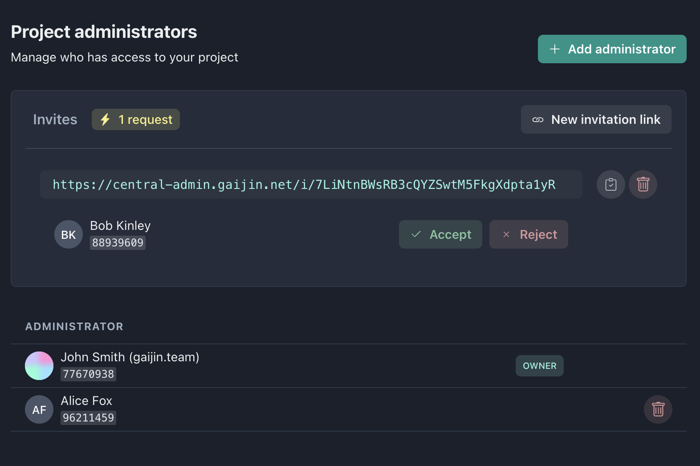

## New Project Registration

- Go to [https://central-admin.gaijin.net](https://central-admin.gaijin.net/)
- Press the **Add project** button
- Enter the project name (_Latin letters, numbers, and spaces are allowed_)

:::info

A project identifier will be generated automatically, based on the project name. All symbols will be made lowercase and spaces will be replaced with the underscore. Thus, for the project named "Mind Games" the mind_games identifier will be generated

:::

- Press the **Create** button

Done. The project has been created and you are its owner and administrator.

## Project Owners and Administrators

A project can have any number of administrators, one of them being its owner. Administrators have full permissions within the project except for being unable to remove the project owner.

There are two ways to add a new administrator:

- Knowing their numerical user identifier (user_id), add them using the “Add administrator” button
- Generate an invitation and send the link to your colleague. After they accept the invitation, their data will need to be confirmed.

On the screenshot above, you can see the project owner John Smith and his assigned administrator Alice Fox. Further above, in the “Invite” section, you can see an invitation link and a request from Bob Kinley waiting for the administrators’ approval.

:::tip

Many users use nicknames in their accounts. Use the possibility of changing a user’s Display Name so as not to get confused about who is who.

:::

## Service accounts

A service account is a special kind of account that can be used by a external applications or services to manage resources within the project.

You can't use service accounts to log in to the system in the usual way. However, you can assign roles and permissions for these accounts, just as you do for regular accounts.

A list of service accounts can be found in the "Service accounts" section of the main menu. Press the **Create service account** button to create a new one.

When you create a new service account, you can specify a display name, comment, and its lifetime (e.g for one year). As a result of creating a service account, you will be issued a token that will allow you to make API requests on behalf of the account.

:::caution

For your protection, you should never share your token with anyone. If you have lost your token or it has been compromised, you can generate a new token for the account.

:::
