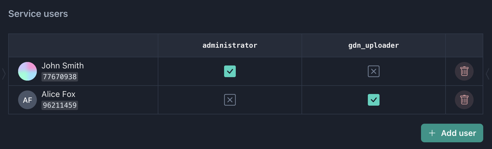
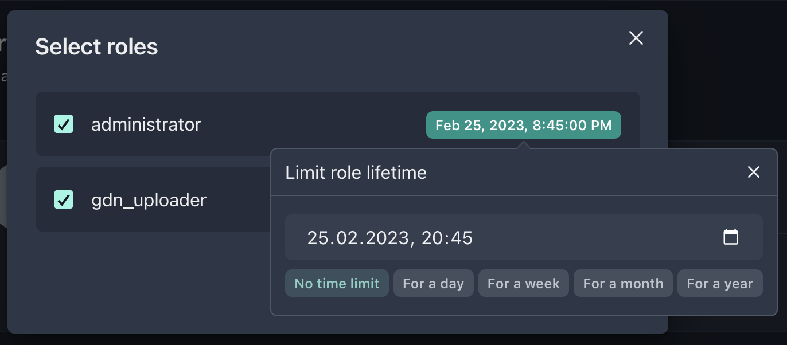

# Services

Gaijin Application Platform offers a range of services allowing the applications in development to use services such as content delivery, matchmaking, leaderboards, inventory, bug reporting, forums and so on.

When necessary, these services are connected to your project. Being that any project needs the content delivery service, the YupMaster GDN service is automatically connected to a new project.

## YupMaster GDN (Gaijin Delivery Network)

This service allows for preparing builds to be uploaded to the content delivery system, marking required versions and making versions available to players.

Only the one who has been assigned the appropriate permissions can perform these operations. Unlike with your own application, you cannot independently define the list of permissions and roles for managing an external service. Instead, each service has a predefined set of roles that can be assigned to users. In particular, the YupMaster service offers two roles: uploader and publisher.

Apart from that, the user adding system operates just like with the other project components.

We add the users who will prepare and deploy builds and assign necessary roles to them.

:::note

Please note. When assigning a role, you can assign it for a time.
That is to arrange for the extended permissions given to a user to be automatically revoked on the expiry of the indicated time.

:::
