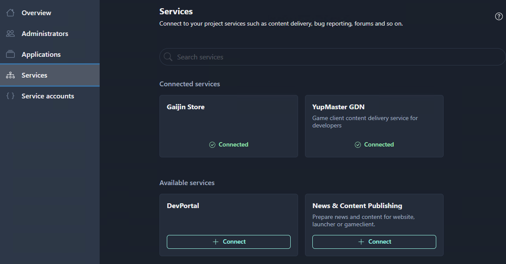

# Services

Gaijin Application Platform allows users with administration rights to expand the functionality of their applications by connecting additional services, such as content delivery, matchmaking, leaderboards, inventory, bug reporting, forums and so on. When necessary, these services can be connected to the project.

GAP offers a range of available services including [YupMaster GDN](uploading-to-gdn.md#yupmaster-gdn-gaijin-delivery-network), the content delivery service that is needed in any project.

The list of available services will expand over time. For details on using services in your project, click [here](../central/services.md).