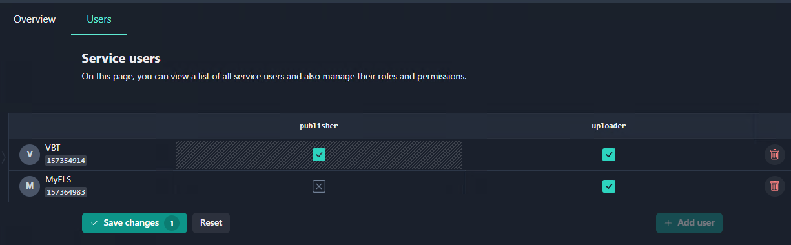

To upload a project to GDN, you need the `YupMaster GDN` service connected to your project. This service allows you to manage builds to be uploaded to the GDN and publish the required versions, making them available to players. To connect `YupMaster GDN` to the project, open `Services` in the [Side navigation](../central/getting-started.md#side-navigation) menu. This page contains a list of [services](../central/services.md) available for your project, as well as a list of already connected services.

There are two types of content you can upload to GDN:

- A game prepared for upload by the launcher using yup files.
- A game for Android, which is uploaded to GDN as an APK file.

The connected `YupMaster GDN` service is required for both types of files to upload.

# YupMaster GDN (Gaijin Delivery Network) service

The purpose of this service is to prepare builds, upload them to the content delivery system, mark required versions, and make them available to players.

Only the user with the appropriate permissions can perform these operations. Each service has a predefined set of roles that can be assigned to users. The `YupMaster GDN` service offers two roles: Uploader and Publisher. Here, you can add the users who will prepare and deploy the builds and assign necessary roles to these users.

If you wish to upload builds to the GDN and make the required version(s) available to other users, you should assign yourself the `Uploader` and `Publisher` roles (not assigned by default). To assign these roles:

1. Select `Services` > `YupMaster GDN`.
1. Click the `Users` tab.

    !!!note
        In order to manage user rights for the `YupMaster GDN` service, you must get the `Administrator` rights in your project, otherwise the `Users` tab will be inactive.

1. Select the checkboxes for the `Publisher` and `Uploader` roles for the required user.
1. Click `Save changes`.
1. Click `Apply`.



Assigning a temporary role you can limit its lifetime. Here, the system will automatically revoke the role at the expiration time. For details on assigning temporary roles, click [here](../central/services.md#setting-temporary-roles-within-a-service).


Clicking the Open button calls the `YupMaster GDN` service administrative interface that enables you to view projects uploaded to GDN and manage tags, making an uploaded project version available to the public.

!!!note
    Alternatively, to open the `YupMaster GDN` administrative interface, follow the link: [https://gdn.gaijin.net/yuitem/admin/](https://gdn.gaijin.net/yuitem/admin/)

# Uploading a Project to Gaijin Distribution Network (GDN) using yup files

## Preparation

To upload a project to GDN, you must have:

-	The `YupMaster GDN` service connected to your project.
-	Appropriate rights needed to upload and manage APKs in the network. The YupMaster GDN service offers two roles: `Uploader` and `Publisher`.

!!!note
    In order to manage user roles for the `YupMaster GDN` service in, you must get administrator rights in your project (see [Owners and Administrators](../central/project-owners-administrators.md)).


To work with the GDN servers, you need the following programs:

- `yupgen.exe` - preparing a build for upload to GDN
- `yupload.exe` - uploading a build to GDN
- `gaijin_updater64.exe` - downloading a version from GDN to a local computer

Download tools from the releases page: [GaijinApplicationPlatform/releases](https://github.com/GaijinEntertainment/GaijinApplicationPlatform/releases)

Now assume that all utilities are available on paths, although they may be located at any place and they may be called up by the full name of the file.

Let’s say that your build is in the `.\builds\release` catalog, counting from the current catalog.

## Generating a YUP file

Invoke the following command:

```
yupgen.exe -path .\builds\release -proj <PROJECT> -ver <VERSION>
```

As a result, in the current catalog, there should appear a file of the form `a2e61e8a631c353b59091a6b17ef64f7f358b70d.yup`

That file contains the description of your build together with the project name, version, a list of all files, and a hash of their content. Being that YUP contains hashes of all the files from the `.\builds\release` catalog, you must not change the content of that catalog after the build.

## Uploading a build

```
yupload.exe a2e61e8a631c353b59091a6b17ef64f7f358b70d.yup -check 0 -src .\builds\release -deploy -tracker http://yuptracker.gaijinent.com:27022/announce -dev https://gdn.gaijin.net/yuitem
```

This command will request a login and a password of the user on whose behalf the operation will be performed, then it will register the build in GDN and perform the build upload, making sure that all the data has been uploaded successfully and can be available for download.

## Managing builds

Build are managed through the administrative panel at [https://gdn.gaijin.net/yuitem/admin/](https://gdn.gaijin.net/yuitem/admin/)

## Downloading a build

Let us suppose that you want to download the build currently marked with the `nightly` tag to the `last_nightly_build` catalog.

```
mkdir last_nightly_build
gaijin_updater64.exe -p <PROJECT> -t nightly -f last_nightly_build --yupmaster gdn.gaijin.net --clear --verbose --norun --noupdate
```

## Uploading APK to Gaijin Distribution Network (GDN)

APK (Android Package Kit) files allows users to install apps on Android phones. Being an archive file, an APK comprises multiple files, plus some metadata that an application needs to install correctly on the Android device.
To distribute an APK, a game developer can upload the APK file to GDN, making it available to other users.

## Preparation

To upload an APK file to GDN, you must have:

-	The `YupMaster GDN` service connected to your project.
     
    This service allows you to manage builds to be uploaded to the GDN and publish the required versions, making them available to players.

-	Appropriate rights needed to upload and manage APKs in the network. 
    
    The YupMaster GDN service offers two roles: `Uploader` and `Publisher`.

!!!note
    In order to manage user rights for the `YupMaster GDN` service in, you must get administrator rights in your project (see [Owners and Administrators](../central/project-owners-administrators.md)).


In order to upload an APK to GDN, the user must have the `Uploader` role.
To publish an APK, making it available to users, and manage tags, you need the `Publisher` role.

The `Uploader` and `Publisher` roles can be granted to the same user, or they can be assigned to different users.


For example, consider the scenario when developers need to upload a test build to GDN. Here, the build system may automatically upload the build but not make an uploaded APK public. When the application is ready for production, a user with the `Publisher role` makes the uploaded APK available to users.

To upload and manage an APK, assign yourself the `Uploader` and `Publisher` roles (not assigned by default) as described in the [Services](../central/services.md) section.


## Uploading an APK

To upload the APK to GDN, use the `apk-uploader.exe` (for Windows) or `apk-uploader` (for Linux) programs:

- [apk-uploader.exe](https://github.com/GaijinEntertainment/GaijinApplicationPlatform/releases/download/1.3.0/apk-uploader.exe) (10.5 MB)
- [apk-uploader](https://github.com/GaijinEntertainment/GaijinApplicationPlatform/releases/download/1.3.0/apk-uploader) (10.2 MB)


You can also find these programs among available tools on the [GaijinApplicationPlatform/releases](https://github.com/GaijinEntertainment/GaijinApplicationPlatform/releases) page.

Suppose that your apk file is called `last_game_build`. Then, to upload the APK to GDN, execute the following command:

```
./apk-uploader --jwt $(cat ~/.gaijin.jwt) --host http://gdn.gaijin.net --project my_new_game --apk-file last_game_build.apk

```

This command uses the following parameters:

-	`gaijin.jwt.jwt` — Your SSO JSON Web token. For details on using JWT, click [here](../basic_concepts/using_JWT.md).
-	`my_new_game` — Name of the project from which you upload APK to GDN.
-	`last_game_build` — Name of the APK to be uploaded to GDN.

After receiving an APK, the server automatically extracts the APK version that is recorded in the APK file and uses it as the version of the uploaded build. Therefore, the name of the APK file does not matter. Only the version that is recorded inside the APK is essential.

Only one APK with the same version can be uploaded to GDN for each project. Therefore, the project name/version pair must be unique. If you try to upload another APK with the same version for the project, you will receive an error.

The apk-uploader program will upload the APK and display uploading progress and its results in the log (aiming for automatic use of the program by the system).

!!!note
    If there is a network connection failure, the program will try to download again and resume once the connection is restored. When the uploading process gets interrupted, the server will store the file for some time and then automatically resume from the interrupted point. This feature is important because some game APKs can be gigabytes in size. If the program failed to upload the file and stopped with an error, then this means that a problem occurred that needs to be identified and resolved.

After downloading an APK, the program returns the following parameters:

-	`project` - Your project name
-	`status`- Status of program execution
-	`tag`- Randomly generated tag
-	`url`- URL that enables a user to access and download the APK
- `version`- APK version

For example:

```json
{
  "project": "my_new_game",
  "status": "OK",
  "tag": "6821ad886468d1ea",
  "url": "https://gdn.gaijin.net/apk/download?proj=my_new_game&tag=6821ad886468d1ea",
  "version": "1.0.1"
}
```
The program returns a link to the uploaded APK file, enabling a user to download it. Therefore, in order to download a file, a user just need to know the project name and tag. Note that the tag parameter is generated randomly by the system.


Open the YupMaster GDN service to access the administrative panel (or follow the link [https://gdn.gaijin.net/yuitem/admin/](https://gdn.gaijin.net/yuitem/admin/)).

If downloaded successfully, the APK will appear in the YupMaster GDN service interface.

# Publishing an uploaded project: managing tags

Users can add and replace tags either via the [administrative panel](https://gdn.gaijin.net/yuitem/admin/) or through the APIs.

To make an uploaded project version available to public, a user with the `Publisher role`, selects the version to be published and changes its tag (randomly generated by the system) to the required tag, i.e. the one that is associated with the link to download the file.

For example, a site that offers users to download a game may have a link and the tag `latest` for navigating to the latest version of the game. In this case, as soon as for some version of uploaded APK, the publisher sets the tag `latest`, then anyone who follows the link will download this version.

If the publisher wants to remove this version of APK from the publication, but leave it available only to developers, then the publisher can replace this tag with a new randomly generated tag and pass it on to the developers. This enables only the developers to download this APK, but not all other users.

## Setting a tag for a new project version

When changing a tag, in no case should you manually remove the tag from the current version and then put this tag on the new one, because users will receive 404 for some time. Moreover, because the server response can be cached, the error may persist for a considerable time for some users. Instead, you just need to specify the required tag for the new version, which will instantly remove this tag from the previous version and place it on the new version. Here, the system will automatically replace this tag with a random one for the previous version.

For example, imagine that users are downloading the current APK version 1.0.0.0 that has the tag “Latest”. To make a new APK version 2.0.0.0 available to all users, you need to upload it to GDN and just set the tag “Latest” to this version 2.0.0.0. The new version 2.0.0.0 will become immediately available to users. In this case, the tag Latest will be automatically removed from version 1.0.0.0 and replaced by the system with a new random tag.

!!!note
    A random tag is generated for an APK version every time when the tag is detached from that version. Therefore, when the system does not know which tag to use, it always sets a random tag.
